## Agenda

</br>

1.  Introduction
2.  Training, Validation, and Test Data
3.  Classification Trees
4.  Classification Algorithm Metrics

# Introduction

## Load the libraries

</br>

Before we start, let's import the data science libraries into Python.

```{python}
#| echo: true
#| output: false

import pandas as pd
import matplotlib.pyplot as plt
import seaborn as sns
from sklearn.model_selection import train_test_split
from sklearn.tree import DecisionTreeClassifier, plot_tree
from sklearn.preprocessing import StandardScaler
from sklearn.metrics import confusion_matrix, ConfusionMatrixDisplay 
from sklearn.metrics import accuracy_score, recall_score, precision_score
```

Here, we use specific functions from the **pandas**, **matplotlib**, **seaborn** and **sklearn** libraries in Python.

## scikit-learn library

-   **scikit-learn** is a robust and popular library for machine learning in Python
-   It provides simple, efficient tools for data mining and data analysis
-   It is built on top of libraries such as **NumPy**, **SciPy**, and **Matplotlib**
-   <https://scikit-learn.org/stable/>

{fig-align="center"}

## Main data science problems

</br>

[**Regression Problems**]{style="color:green;"}. The response is numerical. For example, a person's income, the value of a house, or a patient's blood pressure.

[**Classification Problems**]{style="color:blue;"}. The response is categorical and involves *K* different categories. For example, the brand of a product purchased (A, B, C) or whether a person defaults on a debt (yes or no).

The predictors can be *numerical* or *categorical*.

## Main data science problems

</br>

[**Regression Problems**. The response is numerical. For example, a person's income, the value of a house, or a patient's blood pressure.]{style="color:gray;"}

[**Classification Problems**]{style="color:blue;"}. The response is categorical and involves *K* different categories. For example, the brand of a product purchased (A, B, C) or whether a person defaults on a debt (yes or no).

The predictors can be *numerical* or *categorical*.

## Terminology

</br></br>

Recall that

-   $X$ represents a predictor or explanatory variable.
-   $\boldsymbol{X} = (X_1, X_2, \ldots, X_p)$ represents a collection of $p$ predictors.

## 

</br>

[Response]{style="text-decoration: underline;"}:

::: incremental
-   $Y$ is a [**categorical variable**]{style="color:darkgreen;"} that takes [**2 categories**]{style="color:darkgreen;"} or [**classes**]{style="color:darkgreen;"}.

-   For example, $Y$ can take [0]{style="color:darkgreen;"} or [1]{style="color:darkgreen;"}, [A]{style="color:darkgreen;"} or [B]{style="color:darkgreen;"}, [no]{style="color:darkgreen;"} or [yes]{style="color:darkgreen;"}, [spam]{style="color:darkgreen;"} or [no spam]{style="color:darkgreen;"}.

-   When classes are strings, they are usually encoded as 0 and 1.

    -   The **target class** is the one for which $Y = 1$.
    -   The **reference class** is the one for which $Y = 0$.
:::

## Classification algorithms

</br></br>

Classification algorithms use predictor values [*to predict the class*]{style="color:#4682B4;"} of the response (either target or reference).

</br>

That is, for an unseen record, they use predictor values to predict whether the record belongs to the target class or not.

## The goal of classification algorithms

</br>

[**Goal**]{style="color:darkgreen;"}: Develop a function $C(\boldsymbol{X})$ for predicting $Y = \{0, 1\}$ from $\boldsymbol{X}$.

</br>

. . .

To achieve this goal, most algorithms consider functions $C(\boldsymbol{X})$ that [**predict the probability**]{style="color:brown;"} that $Y$ takes the value of 1.

</br>

. . .

A probability for each class can be very useful for gauging the model’s confidence about the predicted classification.

## Example 1

Consider a spam filter where $Y$ is the email type.

-   The target class is spam. In this case, $Y=1$.
-   The reference class is not spam. In this case, $Y=0$.

. . .

{fig-align="center" width="556" height="178"}

. . .

Both emails would be classified as spam. However, we would have greater confidence in our classification for the second email.

## 

</br>

Technically, $C(\boldsymbol{X})$ works with the *conditional probability*:

::: {style="font-size: 90%;"}
$$P(Y = 1 | X_1 = x_1, X_2 = x_2, \ldots, X_p = x_p) = P(Y = 1 | \boldsymbol{X} = \boldsymbol{x})$$
:::

In words, this is the probability that $Y$ takes a value of 1 [**given that**]{style="color:brown;"} the predictors $\boldsymbol{X}$ have taken the values $\boldsymbol{x} = (x_1, x_2, \ldots, x_p)$.

</br>

. . .

The conditional probability that $Y$ takes the value of 0 is

$$P(Y = 0 | \boldsymbol{X} = \boldsymbol{x}) = 1 - P(Y = 1 | \boldsymbol{X} = \boldsymbol{x}).$$

## Bayes classifier

</br>

It turns out that, if we know the true structure of $P(Y = 1 | \boldsymbol{X} = \boldsymbol{x})$, we can build a good classification function called the [**Bayes classifier**]{style="color:darkblue;"}:

$$C(\boldsymbol{X}) =
    \begin{cases}
      1, & \text{if}\ P(Y = 1 | \boldsymbol{X} = \boldsymbol{x}) > 0.5 \\
      0, & \text{if}\ P(Y = 1 | \boldsymbol{X} = \boldsymbol{x}) \leq 0.5
    \end{cases}.$$

This function classifies to the most probable class using the conditional distribution $P(Y | \boldsymbol{X} = \boldsymbol{x})$.

## 

</br>

[HOWEVER, we don’t (and will never) know the true form of $P(Y = 1 | \boldsymbol{X} = \boldsymbol{x})$!]{style="color:red;"}

</br>

. . .

To overcome this issue, we several methods:

::: incremental
-   [**Logistic Regression**]{style="color:brown;"}: Impose an structure on $P(Y = 1 | \boldsymbol{X} = \boldsymbol{x})$. This was covered in IN1002B.
-   [**Classification Trees**]{style="color:darkblue;"}: Estimate $P(Y = 1 | \boldsymbol{X} = \boldsymbol{x})$ directly. What we will cover today.
-   [**Ensemble methods**]{style="color:orange;"} and [***K*****-Nearest Neighbours**]{style="color:darkgreen;"}: Estimate $P(Y = 1 | \boldsymbol{X} = \boldsymbol{x})$ directly. (If time permits).
:::

## 

</br>

Once we estimate $P(Y = 1 | \boldsymbol{X} = \boldsymbol{x})$ using one of these methods, we plug it into the Bayes classifier:

$$\hat{C}(\boldsymbol{X}) =
    \begin{cases}
      1, & \text{if}\ \hat{P}(Y = 1 | \boldsymbol{X} = \boldsymbol{x}) > 0.5 \\
      0, & \text{if}\ \hat{P}(Y = 1 | \boldsymbol{X} = \boldsymbol{x}) \leq 0.5
    \end{cases}.$$

where

-   $\hat{P}(Y = 1 | \boldsymbol{X} = \boldsymbol{x})$ is an estimate of $P(Y = 1 | \boldsymbol{X} = \boldsymbol{x})$.
-   $\hat{C}(\boldsymbol{X})$ is an estimate of the true Bayes Classifier $C(\boldsymbol{X})$

## Let's play with classification algorithms

</br></br>

1.  <https://quickdraw.withgoogle.com/>

2.  <https://tenso.rs/demos/rock-paper-scissors/>

3.  <https://teachablemachine.withgoogle.com/>

# Training, Validation, and Test Data

## Two datasets

</br></br>

The application of data science algorithms needs two data sets:

::: incremental
-   [**Training data**]{style="color:blue;"} is data that we use to train or construct the approximation $\hat{C}(\boldsymbol{X})$.

-   [**Test data**]{style="color:green;"} is data that we use to evaluate the classification performance of $\hat{C}(\boldsymbol{X})$ only.
:::

## 

::::: columns
::: {.column width="30%"}
{width="256"}
:::

::: {.column width="70%"}
</br>

A random sample of $n$ observations.

Use it to **construct** $\hat{C}(\boldsymbol{X})$.
:::
:::::

::::: columns
::: {.column width="30%"}
{width="262"}
:::

::: {.column width="70%"}
Another random sample of $n_t$ observations, which is independent of the training data.

Use it to **evaluate** $\hat{C}(\boldsymbol{X})$.
:::
:::::

## Validation dataset

In many practical situations, a test dataset is not available. To overcome this issue, we use a [**validation dataset**]{style="color:orange;"}.

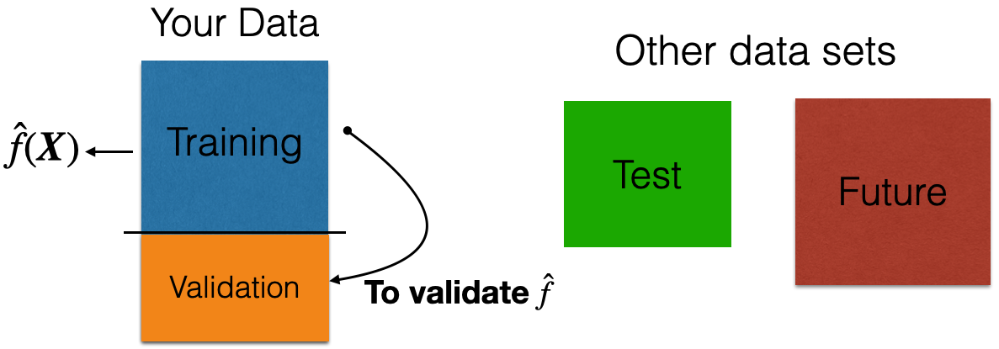{fig-align="center" width="645"}

. . .

**Idea**: Apply model to your [**validation dataset**]{style="color:orange;"} to mimic what will happen when you apply it to test dataset.

## Example 2: Identifying Counterfeit Banknotes

</br>


## Dataset

The data is located in the file "banknotes.xlsx".

```{python}
#| echo: true
#| output: true

bank_data = pd.read_excel("banknotes.xlsx")
# Set response variable as categorical.
bank_data['Status'] = pd.Categorical(bank_data['Status'])
bank_data.head()
```

## How do we generate validation data?

We split the current dataset into a training and a validation dataset. To this end, we use the function `train_test_split()` from **scikit-learn**.

</br>

The function has three main inputs:

-   A pandas dataframe with the predictor columns only.
-   A pandas dataframe with the response column only.
-   The parameter `test_size` which sets the portion of the dataset that will go to the validation set.

## Create the predictor matrix

We use the function `.filter()` from **pandas** to select two predictors: Top and Bottom.

```{python}
#| echo: true
#| output: true

# Set full matrix of predictors.
X_full = bank_data.filter(['Top', 'Bottom'])
X_full.head(4)
```

## Create the response column

We do the same to extract the column `Status` from the data frame. We store the result in `Y_full`.

```{python}
#| echo: true
#| output: true

# Set full matrix of responses.
Y_full = bank_data['Status']
Y_full.head(4)
```

## Set the target category

To set the target category in the response we use the `get_dummies()` function.

```{python}
#| echo: true
#| output: true

# Create dummy variables.
Y_dummies = pd.get_dummies(Y_full, dtype = 'int')

# Select target variable.
Y_target_full = Y_dummies['counterfeit']

# Show target variable.
Y_target_full.head() 
```

## Let's partition the dataset

```{python}
#| echo: true
#| output: true

# Split the dataset into training and validation.
X_train, X_valid, Y_train, Y_valid = train_test_split(X_full, Y_target_full, 
                                                      test_size = 0.3, 
                                                      stratify = Y_target_full,
                                                      random_state=507134)
```

-   Thanks to the `stratify` parameter, the function makes a clever partition of the data using the *empirical* distribution of the response.

-   Technically, it splits the data so that the distribution of the response under the training and validation sets is similar.

-   Usually, the proportion of the dataset that goes to the validation set is 20% or 30%.

## 

The predictors and response in the training dataset are in the objects `X_train` and `Y_train`, respectively. We compile these objects into a single dataset using the function `.concat()` from **pandas**. The argument `axis = 1` tells `.concat()` to concatenate the datasets by their rows.

```{python}
#| echo: true
#| output: true

training_dataset = pd.concat([X_train, Y_train], axis = 1)
training_dataset.head(4)
```

## 

Equivalently, the predictors and response in the validation dataset are in the objects `X_valid` and `Y_valid`, respectively.

```{python}
#| echo: true
#| output: true

validation_dataset = pd.concat([X_valid, Y_valid], axis = 1)
validation_dataset.head()
```

## Work on your training dataset

</br>

After we have partitioned the data, we **work on the** [**training data**]{style="color:blue;"} to develop our predictive pipeline.

The pipeline has two main steps:

1.  Data preprocessing.
2.  Algorithm development.

Note that all preprocessing techniques will also be applied to the [**validation**]{style="color:orange;"} and [**test**]{style="color:green;"} datasets to prepare it for your algorithm!

# Classification Trees

## Decision tree

It is a supervised learning algorithm that predicts or classifies observations using a hierarchical tree structure.

</br>

Main characteristics:

-   Simple and useful for interpretation.

-   Can handle numerical and categorical predictors and responses.

-   Computationally efficient.

-   Nonparametric technique.

## Basic idea of a decision tree

Stratify or segment the predictor space into several simpler regions.

```{python}
#| fig-align: center

# Set plot style
sns.set(style="whitegrid")

# Create the scatter plot using seaborn for discrete color mapping
plt.figure(figsize=(9.3, 5.3))
sns.scatterplot(
    data=bank_data,
    x='Top',
    y='Bottom',
    hue='Status',
    palette={'genuine': 'blue', 'counterfeit': 'orange'},
    s=15,
    edgecolor=None,
    legend='full'
)

# Add decision boundaries
plt.axhline(y=9.55, color='black', linewidth=3)     # Horizontal line
plt.axvline(x=10.95, ymin=0, ymax=0.438, color='black', linewidth=3)  # Left vertical
plt.axvline(x=11.3, ymin=0, ymax=0.438, color='black', linewidth=3)  # Right vertical

# Add region labels
plt.text(8.5, 11.5, r"$R_1$", fontsize=30, fontweight='bold')
plt.text(8.5, 8.0, r"$R_2$", fontsize=30, fontweight='bold')
plt.text(10.95, 7.2, r"$R_3$", fontsize=20, fontweight='bold')
plt.text(11.5, 8.0, r"$R_4$", fontsize=30, fontweight='bold')

# Axis labels
plt.xlabel("Top")
plt.ylabel("Bottom")

# Clean layout
plt.tight_layout()
plt.show()
```

## 

</br>

:::::: center
::::: columns
::: {.column width="50%"}
```{python}
#| fig-align: center
#| 
# Set plot style
sns.set(style="whitegrid")

# Create the scatter plot using seaborn for discrete color mapping
plt.figure(figsize=(6, 6))
sns.scatterplot(
    data=bank_data,
    x='Top',
    y='Bottom',
    hue='Status',
    palette={'genuine': 'blue', 'counterfeit': 'orange'},
    s=15,
    edgecolor=None,
    legend='full'
)

# Add decision boundaries
plt.axhline(y=9.55, color='black', linewidth=3)     # Horizontal line
plt.axvline(x=10.95, ymin=0, ymax=0.438, color='black', linewidth=3)  # Left vertical
plt.axvline(x=11.3, ymin=0, ymax=0.438, color='black', linewidth=3)  # Right vertical

# Add region labels
plt.text(8.5, 11.5, r"$R_1$", fontsize=30, fontweight='bold')
plt.text(8.5, 8.0, r"$R_2$", fontsize=30, fontweight='bold')
plt.text(10.95, 7.2, r"$R_3$", fontsize=20, fontweight='bold')
plt.text(11.5, 8.0, r"$R_4$", fontsize=30, fontweight='bold')

# Axis labels
plt.xlabel("Top")
plt.ylabel("Bottom")

# Clean layout
plt.tight_layout()
plt.show()
```
:::

::: {.column width="50%"}
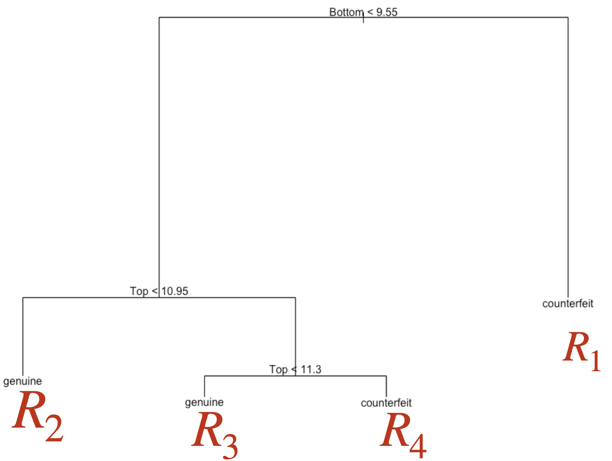{fig-align="center"}
:::
:::::
::::::

## 

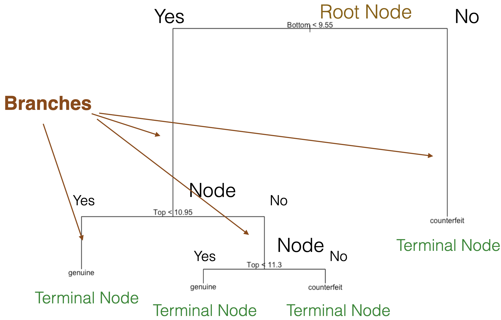{fig-align="center"}

## How do you build a decision tree?

</br></br>

Building decision trees involves two main procedures:

1.  [Grow a large tree.]{style="color:darkblue;"}

2.  [Prune the tree to prevent overfitting.]{style="color:darkblue;"}

After building a “good” tree, we can predict new observations that are not in the data set we used to build it.

## How do we grow a tree?

</br>

. . .

**Using the CART algorithm!**

::: incremental
-   The algorithm uses a recursive binary splitting strategy that builds the tree using a greedy top-down approach.

-   Basically, at a given node, it considers all variables and all possible splits of that variable. Then, for classification, it chooses the best variable and splits it that **minimize** the so-called [***impurity***]{style="color:purple;"}.
:::

## 

</br>

:::::: center
::::: columns
::: {.column width="50%"}
```{python}
#| fig-align: center
#| 
# Set plot style
sns.set(style="whitegrid")

# Create the scatter plot using seaborn for discrete color mapping
plt.figure(figsize=(6, 6))
sns.scatterplot(
    data=bank_data,
    x='Top',
    y='Bottom',
    hue='Status',
    palette={'genuine': 'blue', 'counterfeit': 'orange'},
    s=15,
    edgecolor=None,
    legend='full'
)

# Add decision boundaries
plt.axhline(y=7.2, color='black', linewidth=3)     # Horizontal line

# Axis labels
plt.xlabel("Top")
plt.ylabel("Bottom", color='red')

# Clean layout
plt.tight_layout()
plt.show()
```
:::

::: {.column width="50%"}
:::
:::::
::::::

## 

</br>

:::::: center
::::: columns
::: {.column width="50%"}
```{python}
#| fig-align: center
#| 
# Set plot style
sns.set(style="whitegrid")

# Create the scatter plot using seaborn for discrete color mapping
plt.figure(figsize=(6, 6))
sns.scatterplot(
    data=bank_data,
    x='Top',
    y='Bottom',
    hue='Status',
    palette={'genuine': 'blue', 'counterfeit': 'orange'},
    s=15,
    edgecolor=None,
    legend='full'
)

# Add decision boundaries
plt.axhline(y=7.5, color='black', linewidth=3)     # Horizontal line

# Axis labels
plt.xlabel("Top")
plt.ylabel("Bottom", color='red')

# Clean layout
plt.tight_layout()
plt.show()
```
:::

::: {.column width="50%"}
:::
:::::
::::::

## 

</br>

:::::: center
::::: columns
::: {.column width="50%"}
```{python}
#| fig-align: center
#| 
# Set plot style
sns.set(style="whitegrid")

# Create the scatter plot using seaborn for discrete color mapping
plt.figure(figsize=(6, 6))
sns.scatterplot(
    data=bank_data,
    x='Top',
    y='Bottom',
    hue='Status',
    palette={'genuine': 'blue', 'counterfeit': 'orange'},
    s=15,
    edgecolor=None,
    legend='full'
)

# Add decision boundaries
plt.axhline(y=7.7, color='black', linewidth=3)     # Horizontal line

# Axis labels
plt.xlabel("Top")
plt.ylabel("Bottom", color='red')

# Clean layout
plt.tight_layout()
plt.show()
```
:::

::: {.column width="50%"}
:::
:::::
::::::

## 

</br>

:::::: center
::::: columns
::: {.column width="50%"}
```{python}
#| fig-align: center
#| 
# Set plot style
sns.set(style="whitegrid")

# Create the scatter plot using seaborn for discrete color mapping
plt.figure(figsize=(6, 6))
sns.scatterplot(
    data=bank_data,
    x='Top',
    y='Bottom',
    hue='Status',
    palette={'genuine': 'blue', 'counterfeit': 'orange'},
    s=15,
    edgecolor=None,
    legend='full'
)

# Add decision boundaries
plt.axhline(y=7.9, color='black', linewidth=3)     # Horizontal line

# Axis labels
plt.xlabel("Top")
plt.ylabel("Bottom", color='red')

# Clean layout
plt.tight_layout()
plt.show()
```
:::

::: {.column width="50%"}
:::
:::::
::::::

## 

</br>

:::::: center
::::: columns
::: {.column width="50%"}
```{python}
#| fig-align: center
#| 
# Set plot style
sns.set(style="whitegrid")

# Create the scatter plot using seaborn for discrete color mapping
plt.figure(figsize=(6, 6))
sns.scatterplot(
    data=bank_data,
    x='Top',
    y='Bottom',
    hue='Status',
    palette={'genuine': 'blue', 'counterfeit': 'orange'},
    s=15,
    edgecolor=None,
    legend='full'
)

# Add decision boundaries
plt.axhline(y=12.5, color='black', linewidth=3)     # Horizontal line

# Axis labels
plt.xlabel("Top")
plt.ylabel("Bottom", color='red')

# Clean layout
plt.tight_layout()
plt.show()
```
:::

::: {.column width="50%"}
:::
:::::
::::::

## 

</br>

:::::: center
::::: columns
::: {.column width="50%"}
```{python}
#| fig-align: center
#| 
# Set plot style
sns.set(style="whitegrid")

# Create the scatter plot using seaborn for discrete color mapping
plt.figure(figsize=(6, 6))
sns.scatterplot(
    data=bank_data,
    x='Top',
    y='Bottom',
    hue='Status',
    palette={'genuine': 'blue', 'counterfeit': 'orange'},
    s=15,
    edgecolor=None,
    legend='full'
)

# Add decision boundaries
plt.axvline(x=7.8, color='black', linewidth=3)  # Left vertical

# Axis labels
plt.xlabel("Top", color = "red")
plt.ylabel("Bottom")

# Clean layout
plt.tight_layout()
plt.show()
```
:::

::: {.column width="50%"}
:::
:::::
::::::

## 

</br>

:::::: center
::::: columns
::: {.column width="50%"}
```{python}
#| fig-align: center
#| 
# Set plot style
sns.set(style="whitegrid")

# Create the scatter plot using seaborn for discrete color mapping
plt.figure(figsize=(6, 6))
sns.scatterplot(
    data=bank_data,
    x='Top',
    y='Bottom',
    hue='Status',
    palette={'genuine': 'blue', 'counterfeit': 'orange'},
    s=15,
    edgecolor=None,
    legend='full'
)

# Add decision boundaries
plt.axvline(x=8.0, color='black', linewidth=3)  # Left vertical

# Axis labels
plt.xlabel("Top", color = "red")
plt.ylabel("Bottom")

# Clean layout
plt.tight_layout()
plt.show()
```
:::

::: {.column width="50%"}
:::
:::::
::::::

## 

</br>

:::::: center
::::: columns
::: {.column width="50%"}
```{python}
#| fig-align: center
#| 
# Set plot style
sns.set(style="whitegrid")

# Create the scatter plot using seaborn for discrete color mapping
plt.figure(figsize=(6, 6))
sns.scatterplot(
    data=bank_data,
    x='Top',
    y='Bottom',
    hue='Status',
    palette={'genuine': 'blue', 'counterfeit': 'orange'},
    s=15,
    edgecolor=None,
    legend='full'
)

# Add decision boundaries
plt.axvline(x=8.2, color='black', linewidth=3)  # Left vertical

# Axis labels
plt.xlabel("Top", color = "red")
plt.ylabel("Bottom")

# Clean layout
plt.tight_layout()
plt.show()
```
:::

::: {.column width="50%"}
:::
:::::
::::::

## 

</br>

:::::: center
::::: columns
::: {.column width="50%"}
```{python}
#| fig-align: center
#| 
# Set plot style
sns.set(style="whitegrid")

# Create the scatter plot using seaborn for discrete color mapping
plt.figure(figsize=(6, 6))
sns.scatterplot(
    data=bank_data,
    x='Top',
    y='Bottom',
    hue='Status',
    palette={'genuine': 'blue', 'counterfeit': 'orange'},
    s=15,
    edgecolor=None,
    legend='full'
)

# Add decision boundaries
plt.axvline(x=12.5, color='black', linewidth=3)  # Left vertical

# Axis labels
plt.xlabel("Top", color = "red")
plt.ylabel("Bottom")

# Clean layout
plt.tight_layout()
plt.show()
```
:::

::: {.column width="50%"}
:::
:::::
::::::

## 

</br>

:::::: center
::::: columns
::: {.column width="50%"}
```{python}
#| fig-align: center
#| 
# Set plot style
sns.set(style="whitegrid")

# Create the scatter plot using seaborn for discrete color mapping
plt.figure(figsize=(6, 6))
sns.scatterplot(
    data=bank_data,
    x='Top',
    y='Bottom',
    hue='Status',
    palette={'genuine': 'blue', 'counterfeit': 'orange'},
    s=15,
    edgecolor=None,
    legend='full'
)

# Add decision boundaries
plt.axhline(y=9.55, color='orange', linewidth=3)     # Horizontal line

# Axis labels
plt.xlabel("Top")
plt.ylabel("Bottom")

# Clean layout
plt.tight_layout()
plt.show()
```
:::

::: {.column width="50%"}
{fig-align="center"}
:::
:::::
::::::

## 

</br>

:::::: center
::::: columns
::: {.column width="50%"}
```{python}
#| fig-align: center
#| 
# Set plot style
sns.set(style="whitegrid")

# Create the scatter plot using seaborn for discrete color mapping
plt.figure(figsize=(6, 6))
sns.scatterplot(
    data=bank_data,
    x='Top',
    y='Bottom',
    hue='Status',
    palette={'genuine': 'blue', 'counterfeit': 'orange'},
    s=15,
    edgecolor=None,
    legend='full'
)

# Add decision boundaries
plt.axhline(y=9.55, color='orange', linewidth=3)     # Horizontal line
plt.axvline(x=7.8, ymin=9.55, ymax=0.438, color='black', linewidth=3)  # Left vertical

# Axis labels
plt.xlabel("Top", color = "red")
plt.ylabel("Bottom")

# Clean layout
plt.tight_layout()
plt.show()
```
:::

::: {.column width="50%"}
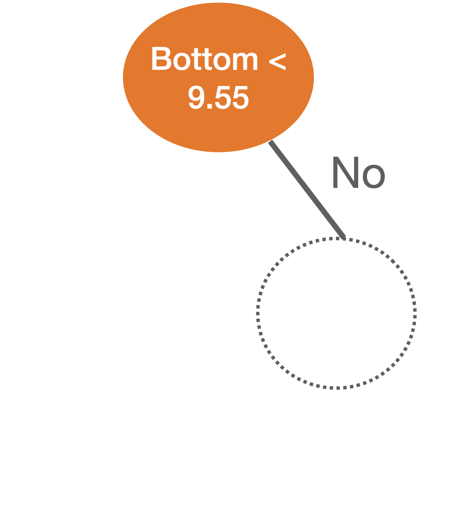{fig-align="center"}
:::
:::::
::::::

## 

</br>

:::::: center
::::: columns
::: {.column width="50%"}
```{python}
#| fig-align: center
#| 
# Set plot style
sns.set(style="whitegrid")

# Create the scatter plot using seaborn for discrete color mapping
plt.figure(figsize=(6, 6))
sns.scatterplot(
    data=bank_data,
    x='Top',
    y='Bottom',
    hue='Status',
    palette={'genuine': 'blue', 'counterfeit': 'orange'},
    s=15,
    edgecolor=None,
    legend='full'
)

# Add decision boundaries
plt.axhline(y=9.55, color='orange', linewidth=3)     # Horizontal line
plt.axvline(x=8.0, ymin=9.55, ymax=0.438, color='black', linewidth=3)  # Left vertical

# Axis labels
plt.xlabel("Top", color = "red")
plt.ylabel("Bottom")

# Clean layout
plt.tight_layout()
plt.show()
```
:::

::: {.column width="50%"}
{fig-align="center"}
:::
:::::
::::::

## 

</br>

:::::: center
::::: columns
::: {.column width="50%"}
```{python}
#| fig-align: center
#| 
# Set plot style
sns.set(style="whitegrid")

# Create the scatter plot using seaborn for discrete color mapping
plt.figure(figsize=(6, 6))
sns.scatterplot(
    data=bank_data,
    x='Top',
    y='Bottom',
    hue='Status',
    palette={'genuine': 'blue', 'counterfeit': 'orange'},
    s=15,
    edgecolor=None,
    legend='full'
)

# Add decision boundaries
plt.axhline(y=9.55, color='orange', linewidth=3)     # Horizontal line
plt.axvline(x=8.2, ymin=9.55, ymax=0.438, color='black', linewidth=3)  # Left vertical

# Axis labels
plt.xlabel("Top", color = "red")
plt.ylabel("Bottom")

# Clean layout
plt.tight_layout()
plt.show()
```
:::

::: {.column width="50%"}
{fig-align="center"}
:::
:::::
::::::

## 

</br>

:::::: center
::::: columns
::: {.column width="50%"}
```{python}
#| fig-align: center
#| 
# Set plot style
sns.set(style="whitegrid")

# Create the scatter plot using seaborn for discrete color mapping
plt.figure(figsize=(6, 6))
sns.scatterplot(
    data=bank_data,
    x='Top',
    y='Bottom',
    hue='Status',
    palette={'genuine': 'blue', 'counterfeit': 'orange'},
    s=15,
    edgecolor=None,
    legend='full'
)

# Add decision boundaries
plt.axhline(y=9.55, color='orange', linewidth=3)     # Horizontal line
plt.axvline(x=12.5, ymin=9.55, ymax=0.438, color='black', linewidth=3)  # Left vertical

# Axis labels
plt.xlabel("Top", color = "red")
plt.ylabel("Bottom")

# Clean layout
plt.tight_layout()
plt.show()
```
:::

::: {.column width="50%"}
{fig-align="center"}
:::
:::::
::::::

## 

</br>

:::::: center
::::: columns
::: {.column width="50%"}
```{python}
#| fig-align: center
#| 
# Set plot style
sns.set(style="whitegrid")

# Create the scatter plot using seaborn for discrete color mapping
plt.figure(figsize=(6, 6))
sns.scatterplot(
    data=bank_data,
    x='Top',
    y='Bottom',
    hue='Status',
    palette={'genuine': 'blue', 'counterfeit': 'orange'},
    s=15,
    edgecolor=None,
    legend='full'
)

# Add decision boundaries
plt.axhline(y=9.55, color='orange', linewidth=3)     # Horizontal line
plt.axvline(x=7.8, ymin=0, ymax=0.43, color='black', linewidth=3)  # Left vertical
plt.axvline(x=8.0, ymin=0, ymax=0.43, color='black', linewidth=3)  # Left vertical
plt.axvline(x=8.2, ymin=0, ymax=0.43, color='black', linewidth=3)  # Left vertical
plt.axvline(x=12.5, ymin=0, ymax=0.43, color='black', linewidth=3)  # Left vertical


# Axis labels
plt.xlabel("Top", color = "red")
plt.ylabel("Bottom")

# Clean layout
plt.tight_layout()
plt.show()
```
:::

::: {.column width="50%"}
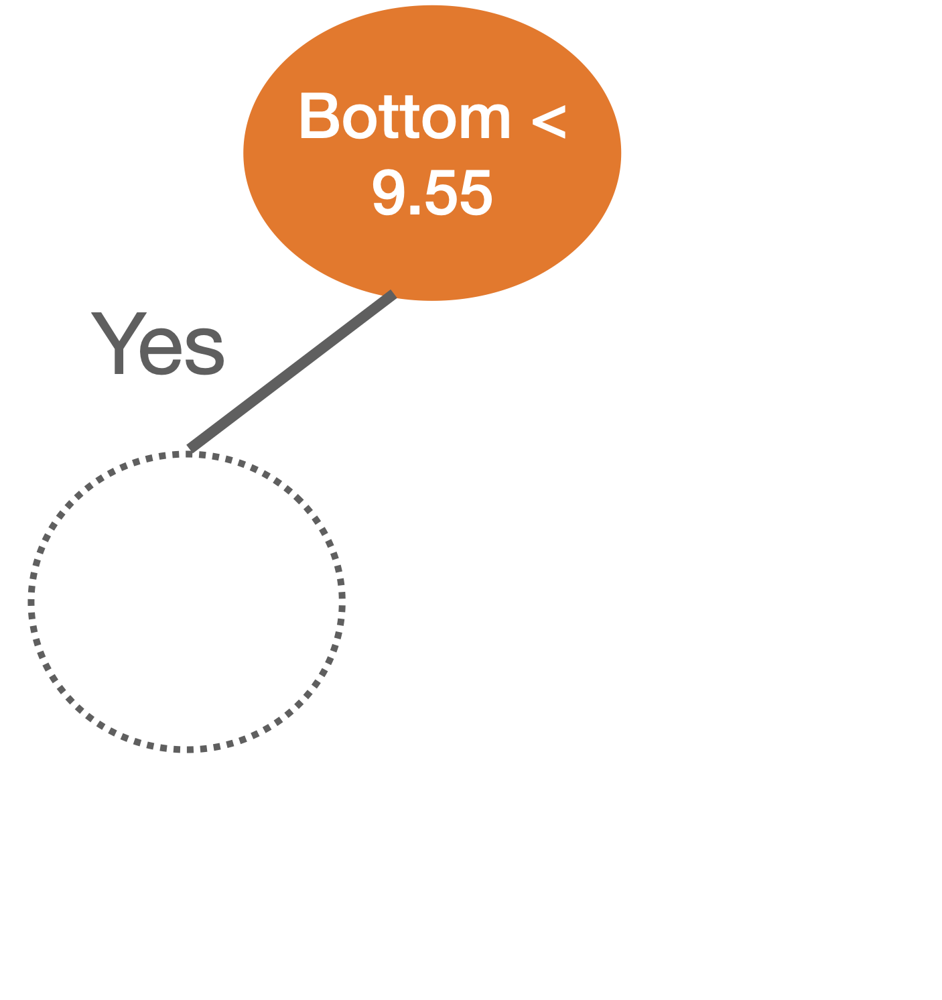{fig-align="center"}
:::
:::::
::::::

## 

</br>

:::::: center
::::: columns
::: {.column width="50%"}
```{python}
#| fig-align: center
#| 
# Set plot style
sns.set(style="whitegrid")

# Create the scatter plot using seaborn for discrete color mapping
plt.figure(figsize=(6, 6))
sns.scatterplot(
    data=bank_data,
    x='Top',
    y='Bottom',
    hue='Status',
    palette={'genuine': 'blue', 'counterfeit': 'orange'},
    s=15,
    edgecolor=None,
    legend='full'
)

# Add decision boundaries
plt.axhline(y=9.55, color='orange', linewidth=3)     # Horizontal line
plt.axvline(x=10.95, ymin=0, ymax=0.43, color='green', linewidth=3)  # Left vertical


# Axis labels
plt.xlabel("Top", color = "red")
plt.ylabel("Bottom")

# Clean layout
plt.tight_layout()
plt.show()
```
:::

::: {.column width="50%"}
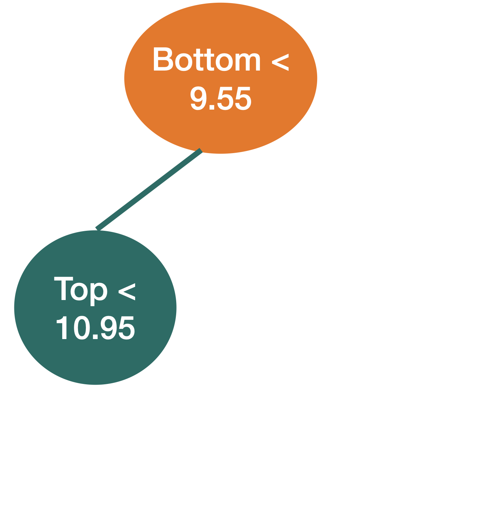{fig-align="center"}
:::
:::::
::::::

## 

</br>

:::::: center
::::: columns
::: {.column width="40%"}
We repeat the partitioning process until:

-   *impurity* does not improve in any of the terminal nodes, or
-   each terminal node has no less than, say, 5 observations.
:::

::: {.column width="60%"}
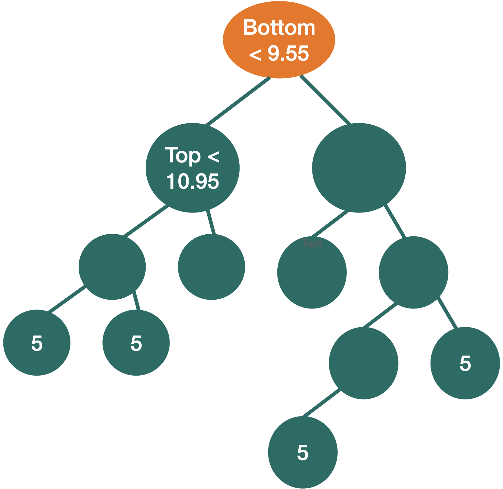{fig-align="center"}
:::
:::::
::::::

## What is impurity?

Node impurity refers to the homogeneity of the response classes at that node.

:::::: center
::::: columns
::: {.column width="50%"}
{fig-align="center"}
:::

::: {.column width="50%"}
{fig-align="center"}
:::
:::::
::::::

[*The CART algorithm minimizes impurity between tree nodes.*]{style="color:darkgray;"}

## How do we measure impurity?

::::::: center
:::::: columns
::: {.column width="40%"}
</br>

There are three different metrics for impurity:

-   Misclassification risk.

-   Cross entropy.

-   Gini impurity index.
:::

:::: {.column width="60%"}
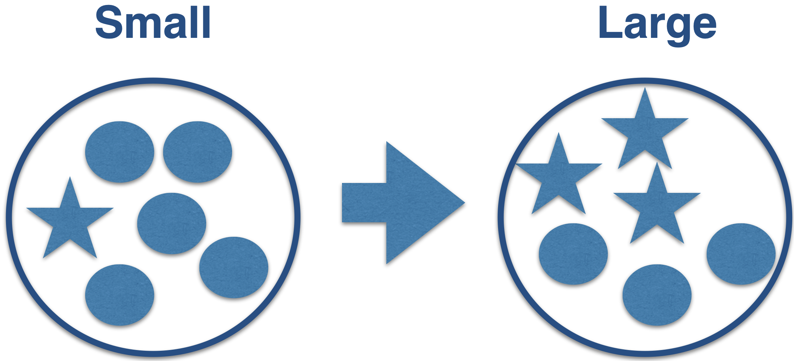{fig-align="center" width="469"} 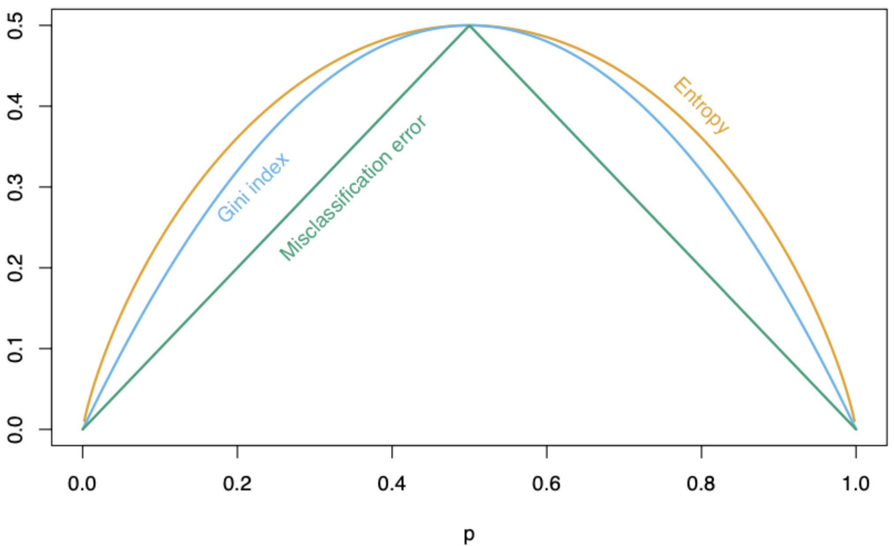{fig-align="center" width="396"}

::: {style="font-size: 50%;"}
p: Proportion of elements in the target class
:::
::::
::::::
:::::::

## Mathematically

</br>

Let $p_1$ and $p_2$ be the proportion of observations in the target and reference class, respectively, in a node.

-   Misclassification risk: $1 - \max\{p_1, p_2\}$

-   Cross entropy: $- (p_1 \log(p_1) + p_2 \log(p_2))$

-   Gini impurity index: $p_1(1 - p_1) + p_2(1 - p_2)$

## In Python

In Python, we use the `DecisionTreeClassifier()` and `fit()` functions from **scikit-learn** to train a classification tree.

```{python}
#| echo: true
#| output: false

# We tell Python we want a classification tree
clf = DecisionTreeClassifier(min_samples_leaf= 5, ccp_alpha=0, 
                              random_state=507134)

# We train the classification tree using the training data.
clf.fit(X_train, Y_train)
```

The parameter `min_samples_leaf` controls the minimum number of observations in a terminal node, and the `cc_alpha` controls the tree complexity (to be described later). The parameter `random_state` allows you to reproduce the same tree in different runs of the Python code.

## Plotting the tree

</br>

To see the decision tree, we use the `plot_tree` function from **scikit-learn** and some commands from **matplotlib**. Specifically, we use the `plt.figure()` functions to define the size of the figure and `plt.show()` to display the figure.

```{python}
#| echo: true
#| output: false
#| fig-align: center

plt.figure(figsize=(6, 6))
plot_tree(clf, feature_names = X_train.columns,
    class_names=["genuine", "counterfeit"], filled=True, rounded=True)
plt.show()
```

## 

</br>

```{python}
#| echo: false
#| output: true
#| fig-align: center

plt.figure(figsize=(8, 6))
plot_tree(clf, feature_names = X_train.columns,
    class_names=["genuine", "counterfeit"], filled=True, rounded=True)
plt.show()
```

## The tree in the predictor space

</br>

```{python}
#| fig-align: center

# Set plot style
sns.set(style="whitegrid")

# Create the scatter plot using seaborn for discrete color mapping
plt.figure(figsize=(9.3, 5.3))
sns.scatterplot(
    data=training_dataset,
    x='Top',
    y='Bottom',
    hue='counterfeit',
    palette={0: 'blue', 1: 'orange'},
    s=15,
    edgecolor=None,
    legend='full'
)

# Add decision boundaries
plt.axhline(y=9.25, color='black', linewidth=3)     # Horizontal line
plt.axvline(x=10.95, ymin=0, ymax=0.38, color='black', linewidth=3)  # Left vertical
plt.axvline(x=10.25, ymin=0.385, color='black', linewidth=3)  # Left vertical
plt.axvline(x=11.3, ymin=0, ymax=0.38, color='black', linewidth=3)  # Right vertical

# Axis labels
plt.xlabel("Top")
plt.ylabel("Bottom")

# Clean layout
plt.tight_layout()
plt.show()
```

## Estimated conditional probabilities

</br>

After training a classification tree, we can calculate the estimated conditional probability $\hat{P}(Y = 1 | \boldsymbol{X} = \boldsymbol{x})$.

To this end, let

-   $\hat{p}_1(\boldsymbol{x}) = \hat{P}(Y = 1 | \boldsymbol{X} = \boldsymbol{x})$
-   $\hat{p}_0(\boldsymbol{x}) = 1 - \hat{p}_1(\boldsymbol{x})$

be the estimated probabilities that $\boldsymbol{x}$ belongs to class 1 or 0.

## 

</br></br>

Essentially, we calculate $\hat{p}_1(\boldsymbol{x})$ and $\hat{p}_0(\boldsymbol{x})$ as follows:

1.  Select the region or terminal node where $\boldsymbol{x}$ belongs.
2.  $\hat{p}_1(\boldsymbol{x})$ is the proportion of observations in *that* terminal node that belong to class 1. $\hat{p}_0(\boldsymbol{x})$ is the proportion of observations that belong to class 0.

## Visually

Let $(\hat{p}_0(\boldsymbol{x}), \hat{p}_1(\boldsymbol{x}))$ be the estimated probabilities.

```{python}
#| fig-align: center

# Set plot style
sns.set(style="whitegrid")

# Create the scatter plot using seaborn for discrete color mapping
plt.figure(figsize=(9.3, 5.3))
sns.scatterplot(
    data=training_dataset,
    x='Top',
    y='Bottom',
    hue='counterfeit',
    palette={0: 'blue', 1: 'orange'},
    s=15,
    edgecolor=None,
    legend='full'
)

# Add decision boundaries
plt.axhline(y=9.25, color='black', linewidth=3)     # Horizontal line
plt.axvline(x=10.95, ymin=0, ymax=0.38, color='black', linewidth=3)  # Left vertical
plt.axvline(x=10.25, ymin=0.385, color='black', linewidth=3)  # Left vertical
plt.axvline(x=11.3, ymin=0, ymax=0.38, color='black', linewidth=3)  # Right vertical

# Add region labels
plt.text(9.05, 11.5, r"(0.3, 0.7)", fontsize=30)
plt.text(11.5, 11.5, r"(0, 1)", fontsize=30)
plt.text(9.05, 7.2, r"(1, 0)", fontsize=30)
plt.text(11.05, 7.2, r"(0.7, 0.3)", fontsize=20, rotation=90)
plt.text(11.5, 7.2, r"(0.3, 0.7)", fontsize=30)

# Axis labels
plt.xlabel("Top")
plt.ylabel("Bottom")

# Clean layout
plt.tight_layout()
plt.show()
```

## Estimated Bayes Classifier

</br>

Once we have estimated the conditional probability using the classification tree, we plug it into the Bayes classifier to have our approximated function:

$$\hat{C}(\boldsymbol{x}) =
    \begin{cases}
      1, & \text{if}\ \hat{p}_1(\boldsymbol{x}) > 0.5 \\
      0, & \text{if}\ \hat{p}_1(\boldsymbol{x}) \leq 0.5
    \end{cases},$$

where $\hat{p}_1(\boldsymbol{x})$ depends on the region or terminal node $\boldsymbol{x}$ falls in.

## Simplified decision boundary

</br>

```{python}
#| echo: false
#| output: true
#| fig-align: center

from sklearn.inspection import DecisionBoundaryDisplay

# Make sure the feature order matches exactly what was used in clf.fit
X = X_train[['Top', 'Bottom']]  


# Create decision boundary plot
disp = DecisionBoundaryDisplay.from_estimator(
    clf,
    X,
    response_method="predict",
    xlabel="Top",
    ylabel="Bottom",
    grid_resolution=200,
    cmap=plt.cm.Paired,
    alpha=0.5
)

# Overlay actual data points
disp.ax_.scatter(
    X['Top'],
    X['Bottom'],
    c=Y_train,
    cmap=plt.cm.Paired,
    edgecolor='k'
)

disp.ax_.set_title("Decision Boundary of Classification Tree")
plt.show()
```

## Decision boundary logistic regression

</br>

```{python}
#| echo: false
#| output: true
#| fig-align: center

from sklearn.linear_model import LogisticRegression

# Prepare features in the same order: Top (x-axis), Bottom (y-axis)
X = X_train[['Top', 'Bottom']]

# Train logistic regression
log_reg = LogisticRegression()
log_reg.fit(X, Y_train)

# Create decision boundary plot
disp = DecisionBoundaryDisplay.from_estimator(
    log_reg,
    X,
    response_method="predict",
    xlabel="Top",
    ylabel="Bottom",
    grid_resolution=200,
    cmap=plt.cm.Paired,
    alpha=0.5
)

# Overlay actual training data points
disp.ax_.scatter(
    X['Top'],
    X['Bottom'],
    c=Y_train,
    cmap=plt.cm.Paired,
    edgecolor='k'
)

disp.ax_.set_title("Decision Boundary of Logistic Regression")
plt.show()

```

## Implementation details

-   Categorical predictors with unordered levels $\{A, B, C\}$. We order the levels in a specific way (works for binary and regression problems).

-   Predictors with missing values. For quantitative predictors, we use multiple imputation. For categorical predictors, we create a new "NA" level.

-   Tertiary or quartary splits. There is not much improvement.

-   Diagonal splits (using a linear combination for partitioning). These can lead to improvement, but they impair interpretability.

# Classification Metrics

## Evaluation

</br>

We evaluate a classification tree by classifying observations that were not used for training.

That is, we use the classifier to predict categories in the validation data set using only the predictor values from this set.

In Python, we use the commands:

```{python}
#| echo: true

# Predict classes.
predicted_class = clf.predict(X_valid)
```

## 

</br>

The `predict()` function generates actual classes to which each observation was assigned.

```{python}
#| echo: true
#| output: true

predicted_class
```

## 

</br>

```{python}
#| echo: false
#| output: true
#| fig-align: center

# Ensure feature order matches the training model
X_train_plot = X_train[['Top', 'Bottom']]
X_valid_plot = X_valid[['Top', 'Bottom']]

# Create decision boundary plot
disp = DecisionBoundaryDisplay.from_estimator(
    clf,
    X_train_plot,
    response_method="predict",
    xlabel="Top",
    ylabel="Bottom",
    grid_resolution=200,
    cmap=plt.cm.Paired,
    alpha=0.5
)

# Overlay training points (colored by class)
disp.ax_.scatter(
    X_train_plot['Top'],
    X_train_plot['Bottom'],
    c=Y_train,
    cmap=plt.cm.Paired,
    edgecolor='k'
)

# Overlay validation points (black)
disp.ax_.scatter(
    X_valid_plot['Top'],
    X_valid_plot['Bottom'],
    c='black',
    edgecolor='k',
    label='Validation'
)

disp.ax_.set_title("Decision Boundary of Classification Tree")
disp.ax_.legend()
plt.show()

```

## 

The `predict_proba()` function generates the probabilities used by the algorithm to assign the classes.

```{python}
#| echo: true
#| output: true

# Predict probabilities.
predicted_probability = clf.predict_proba(X_valid)
predicted_probability
```

## Confusion matrix

-   Table to evaluate the performance of a classifier.

-   Compares actual values with the predicted values of a classifier.

-   Useful for binary and multiclass classification problems.

{fig-align="center"}

## In Python

</br>

We calculate the confusion matrix using the homonymous function **scikit-learn**.

```{python}
#| echo: true
#| output: true

# Compute confusion matrix.
cm = confusion_matrix(Y_valid, predicted_class)

# Show confusion matrix.
print(cm)
```

## 

</br>

We can display the confusion matrix using the `ConfusionMatrixDisplay()` function.

```{python}
#| echo: true
#| output: true
#| fig-align: center

CMplot = ConfusionMatrixDisplay(cm, display_labels = ["genuine", "counterfeit"])
CMplot.plot()
```

## Accuracy

It is a simple metric for summarizing the information in the confusion matrix. It is the proportion of correct classifications for both classes, out of the total classifications performed.

</br>

In Python, we calculate accuracy using the **scikit-learn** `accuracy_score()` function.

```{python}
#| echo: true
#| output: true

accuracy = accuracy_score(Y_valid, predicted_class)
print( round(accuracy, 2) )
```

The higher the accuracy, the better the performance of the classification algorithm.

## Pruning the tree

In some cases, we can optimize the performance of the tree by pruning it. That is, we collapse two internal (non-terminal) nodes.

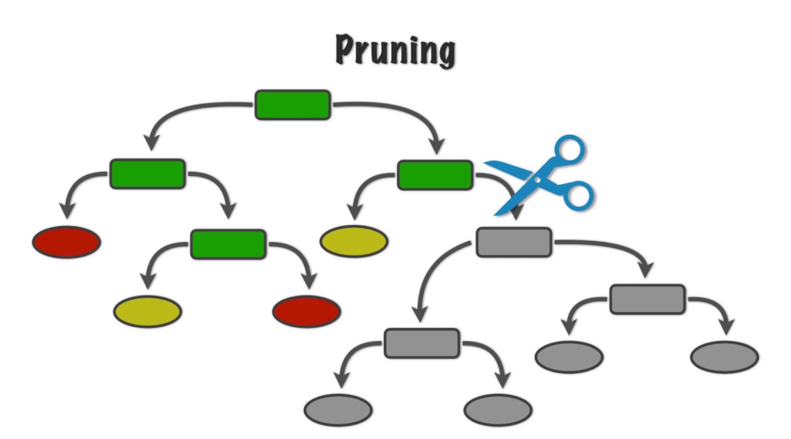{fig-align="center"}

## 

</br>

:::::: center
::::: columns
::: {.column width="50%"}
```{python}
#| fig-align: center
#| 
# Set plot style
sns.set(style="whitegrid")

# Create the scatter plot using seaborn for discrete color mapping
plt.figure(figsize=(6, 6))
sns.scatterplot(
    data=bank_data,
    x='Top',
    y='Bottom',
    hue='Status',
    palette={'genuine': 'blue', 'counterfeit': 'orange'},
    s=15,
    edgecolor=None,
    legend='full'
)

# Add decision boundaries
plt.axhline(y=9.55, color='black', linewidth=3)     # Horizontal line
plt.axvline(x=10.95, ymin=0, ymax=0.438, color='black', linewidth=3)  # Left vertical
plt.axvline(x=11.3, ymin=0, ymax=0.438, color='black', linewidth=3)  # Right vertical

# Add region labels
plt.text(8.5, 11.5, r"$R_1$", fontsize=30, fontweight='bold')
plt.text(8.5, 8.0, r"$R_2$", fontsize=30, fontweight='bold')
plt.text(10.95, 7.2, r"$R_3$", fontsize=20, fontweight='bold')
plt.text(11.5, 8.0, r"$R_4$", fontsize=30, fontweight='bold')

# Axis labels
plt.xlabel("Top")
plt.ylabel("Bottom")

# Clean layout
plt.tight_layout()
plt.show()
```
:::

::: {.column width="50%"}
{fig-align="center"}
:::
:::::
::::::

## 

</br>

:::::: center
::::: columns
::: {.column width="50%"}
```{python}
#| fig-align: center
#| 
# Set plot style
sns.set(style="whitegrid")

# Create the scatter plot using seaborn for discrete color mapping
plt.figure(figsize=(6, 6))
sns.scatterplot(
    data=bank_data,
    x='Top',
    y='Bottom',
    hue='Status',
    palette={'genuine': 'blue', 'counterfeit': 'orange'},
    s=15,
    edgecolor=None,
    legend='full'
)

# Add decision boundaries
plt.axhline(y=9.55, color='black', linewidth=3)     # Horizontal line
plt.axvline(x=10.95, ymin=0, ymax=0.438, color='black', linewidth=3)  # Left vertical
#plt.axvline(x=11.3, ymin=0, ymax=0.438, color='black', linewidth=3)  # Right vertical

# Add region labels
plt.text(8.5, 11.5, r"$R_1$", fontsize=30, fontweight='bold')
plt.text(8.5, 8.0, r"$R_2$", fontsize=30, fontweight='bold')
plt.text(10.95, 7.2, r"$R_3$", fontsize=20, fontweight='bold')

# Axis labels
plt.xlabel("Top")
plt.ylabel("Bottom")

# Clean layout
plt.tight_layout()
plt.show()
```
:::

::: {.column width="50%"}
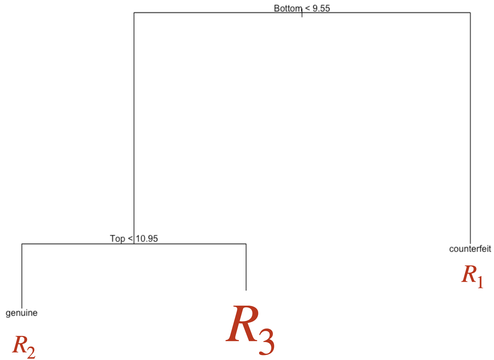{fig-align="center"}
:::
:::::
::::::

## 

</br>

To prune a tree, we use an advanced algorithm to measure the contribution of the tree's branches.

This algorithm minimizes the following function:

::: {style="font-size: 90%;"}
$$\text{Missclassification rate of tree} + \alpha (\text{\# terminal nodes}),$$
:::

where $\alpha$ is a tuning parameter that **places greater weight on the number of tree nodes** (or size).

-   Large values of $\alpha$ result in small trees with few nodes.

-   Small values of $\alpha$ result in large trees with many nodes.

## Apply penalty for large trees

Now, let's illustrate the pruning technique to find a small decision tree that performs well. To do this, we will train several decision trees using different values of $\alpha$, which weighs the contribution of the tree branches.

</br>

In Python, this is achieved using the `cost_complexity_pruning_path()` function with the following syntax.

```{python}
#| echo: true
#| output: false

path = clf.cost_complexity_pruning_path(X_train, Y_train)
ccp_alphas = path.ccp_alphas
```

## 

</br>

The `ccp_alphas` object contains the different values of $\alpha$ used. To train a decision tree using different $\alpha$ values, we use the following code that iterates over the values contained in `ccp_alphas`.

```{python}
#| echo: true
#| output: false

clfs = []
for ccp_alpha in ccp_alphas:
    clf_alpha = DecisionTreeClassifier(min_samples_leaf= 5, 
                                       ccp_alpha=ccp_alpha, 
                                       random_state=507134)
    clf_alpha.fit(X_train, Y_train)
    clfs.append(clf_alpha)
```

## 

</br>

Now, for each of those trees contained in `clfs`, we evaluate the performance in terms of accuracy for the training and validation data.

```{python}
#| echo: true
#| output: false

train_scores = [clf.score(X_train, Y_train) for clf in clfs]
validation_scores = [clf.score(X_valid, Y_valid) for clf in clfs]
```

</br>

The `.score()` function computes the accuracy of a classification tree.

## 

We visualize the results using the following plot.

```{python}
#| echo: true
#| output: true
#| code-fold: true
#| fig-align: center 

fig, ax = plt.subplots()
ax.set_xlabel("alpha")
ax.set_ylabel("Accuracy")
ax.set_title("Accuracy vs alpha for training and validation data")
ax.plot(ccp_alphas, train_scores, marker="o", label="train", drawstyle="steps-post")
ax.plot(ccp_alphas, validation_scores, marker="o", label="validation", drawstyle="steps-post")
ax.legend()
plt.show()
```

## Choosing the best tree

</br>

We can see that the best $\alpha$ value for the validation dataset is 0.

To train our new reduced tree, we use the `DecisionTreeClassifier()` function again with the `ccp_alpha` parameter set to the best $\alpha$ value. The object containing this new tree is `clf_simple`.

```{python}
#| echo: true
#| output: false

# We tell Python that we want a classification tree
clf_simple = DecisionTreeClassifier(ccp_alpha = 0, min_samples_leaf = 5)

# We train the classification tree using the training data.
clf_simple.fit(X_train, Y_train)
```

## 

Once this is done, we can visualize the small tree using the `plot_tree()` function.

```{python}
#| echo: true
#| output: true
#| fig-align: center

plt.figure(figsize=(6, 6))
plot_tree(clf_simple, feature_names = X_train.columns,
    class_names=["genuine", "counterfeit"], filled=True, rounded=True)
plt.show()
```

## 

</br></br></br>

The accuracy of the pruned tree is:

```{python}
#| echo: true
#| output: true

single_tree_Y_pred = clf_simple.predict(X_valid)
accuracy = accuracy_score(Y_valid, single_tree_Y_pred)
print( round(accuracy, 2) )
```

## Comments on accuracy

</br>

-   Accuracy is easy to calculate and interpret.

-   It works well when the data set has a balanced class distribution (i.e., cases 1 and 0 are approximately equal).

-   However, there are situations in which identifying the target class is more important than the reference class.

-   For example, it is not ideal for unbalanced data sets. When one class is much more frequent than the other, accuracy can be misleading.

## An example

</br>

-   Let's say we want to create a classifier that tells us whether a mobile phone company's customer will churn next month.

-   Customers who churn significantly decrease the company's revenue. That's why it's important to retain these customers.

-   To retain that customer, the company will send them a text message with an offer for a low-cost mobile plan.

-   Ideally, our classifier correctly identifies customers who will churn, so they get the offer and, hopefully, stay.

## 

</br></br></br>

-   In other words, we want to avoid making wrong decisions about customers who will churn.

-   Wrong decisions about loyal customers aren't as relevant.

-   Because if we classify a loyal customer as one who will churn, the customer will get a good deal. They'll probably pay less but stay anyway.

## Another example

-   Another example is developing an algorithm (classifier) that can quickly identify patients who may have a rare disease and need a more extensive and expensive medical evaluation.

-   The classifier must make correct decisions about patients with the rare disease, so they can be evaluated and eventually treated.

-   A healthy patient who is misclassified with the disease will only incur a few extra dollars to pay for the next test, only to discover that the patient does not have the disease.

## Classification-specific metrics

</br></br>

To overcome this limitation of accuracy, there are several class-specific metrics. The most popular are:

-   [**Sensitivity**]{style="color:darkblue;"} or *recall*

-   [**Precision**]{style="color:darkgreen;"}

-   **Type I error**

These metrics are calculated from the confusion matrix.

## 

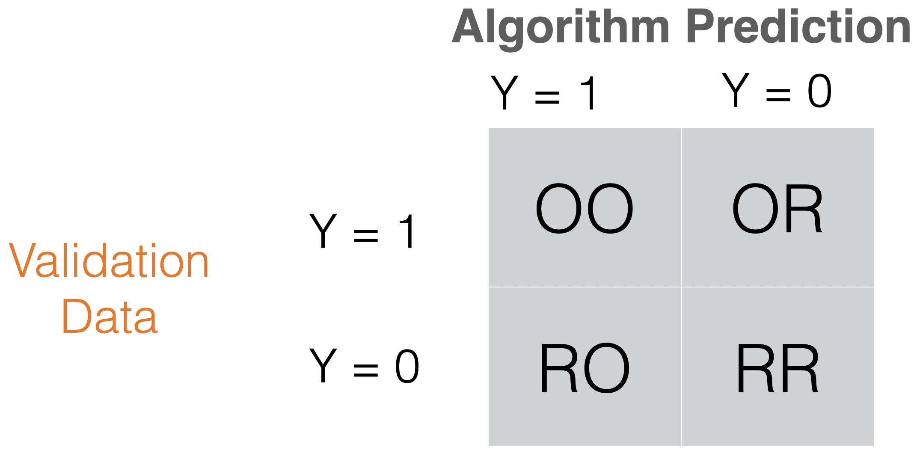{fig-align="center"}

[**Sensitivity**]{style="color:darkblue;"} or *recall* = OO/(OO + OR) “How many records of the target class did we predict correctly?”

## 

{fig-align="center"}

[**Precision**]{style="color:darkgreen;"} = OO/(OO + RO) How many of the records we predicted as target class were classified correctly?

## 

</br></br>

In Python, we compute sensitivity and precision using the following commands:

```{python}
#| echo: true
#| output: true

recall = recall_score(Y_valid, predicted_class)
print( round(recall, 2) )
```

</br>

```{python}
#| echo: true
#| output: true

precision = precision_score(Y_valid, predicted_class)
print( round(precision, 2) )
```

## 

{fig-align="center"}

**Type I error** = RO/(RO + RR) “How many of the reference records did we incorrectly predict as targets?”

## 

</br></br></br>

Unfortunately, there is no simple command to calculate the type-I error in **sklearn**. To overcome this issue, we must calculate it manually.

```{python}
#| echo: true
#| output: true

# Confusion matrix to compute Type-I error
tn, fp, fn, tp = confusion_matrix(Y_valid, predicted_class).ravel()

# Type-I error rate = False Positive Rate = FP / (FP + TN)
type_I_error = fp / (fp + tn)
print( round(type_I_error, 2) )
```

## Discussion

</br>

-   There is generally a trade-off between sensitivity and Type I error.

-   Intuitively, increasing the sensitivity of a classifier is likely to increase Type I error, because more observations are predicted as positive.

-   Possible trade-offs between sensitivity and Type I error may be appropriate when there are different penalties or costs associated with each type of error.

## Disadvantages of decision trees

-   Decision trees have high variance. A small change in the training data can result in a very different tree.

-   It has trouble identifying simple data structures.

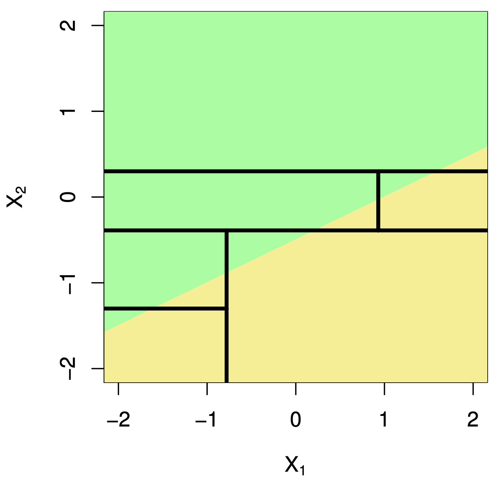{fig-align="center"}


# [Return to main page](https://alanrvazquez.github.io/TEC-IN5148/)
