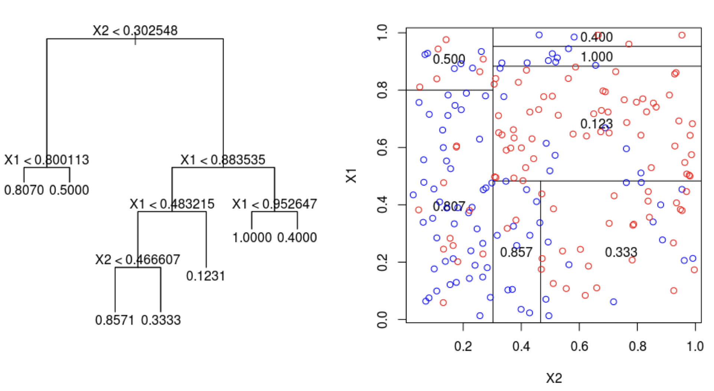
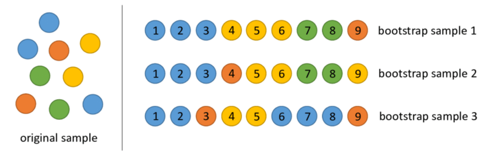
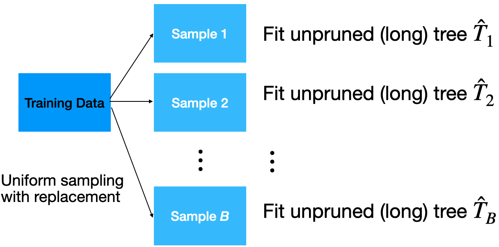
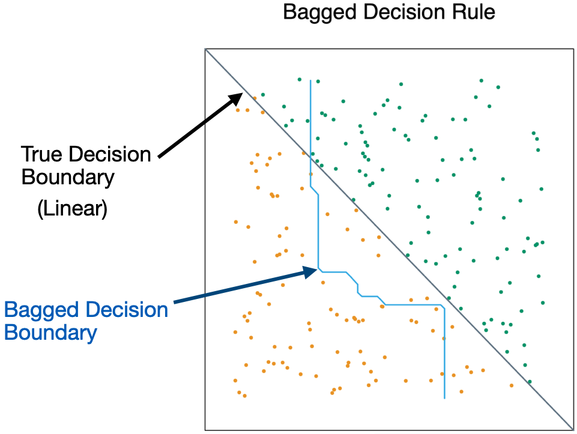
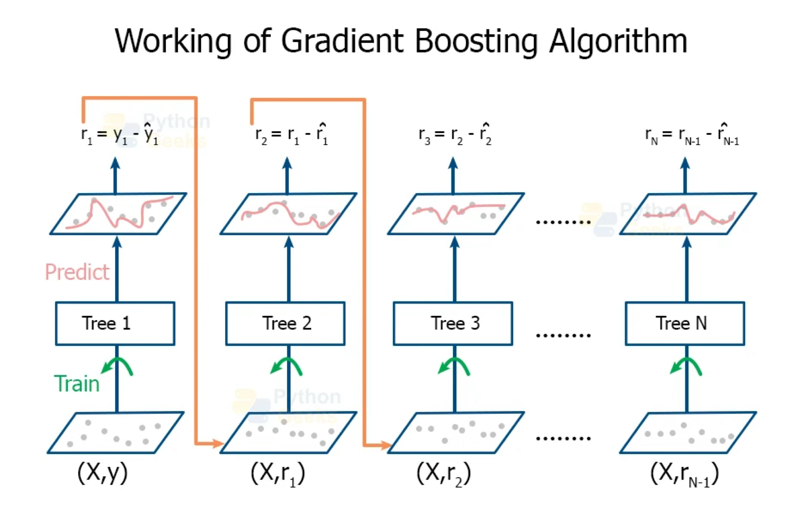
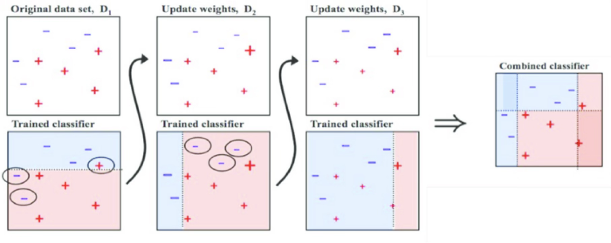
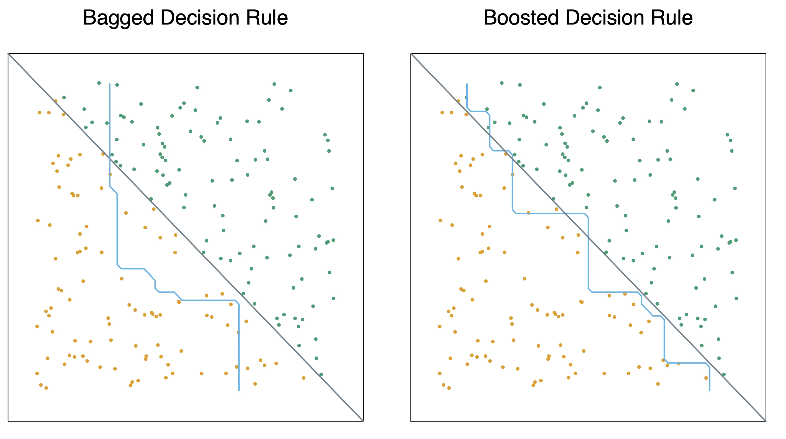

## Agenda

</br>

1.  Introduction to Ensemble Methods
2.  Bagging
3.  Random Forests
4.  Boosting

# Ensamble Methods

## Load the libraries

Before we start, let's import the data science libraries into Python.

```{python}
#| echo: true
#| output: false

# Importing necessary libraries
import pandas as pd
import matplotlib.pyplot as plt
import seaborn as sns
from sklearn.model_selection import train_test_split
from sklearn.tree import DecisionTreeClassifier, plot_tree
from sklearn.ensemble import BaggingClassifier, RandomForestClassifier
from sklearn.neighbors import KNeighborsClassifier
from sklearn.preprocessing import StandardScaler
from sklearn.metrics import confusion_matrix, ConfusionMatrixDisplay 
from sklearn.metrics import accuracy_score, recall_score, precision_score
```

Here, we use specific functions from the **pandas**, **matplotlib**, **seaborn** and **sklearn** libraries in Python.

## Decision trees

</br>

:::::: columns
:::: {.column width="45%"}
::: {style="font-size: 90%;"}
-   Simple and useful for interpretations.

-   Can handle continuous and categorical predictors and responses. So, they can be applied to both [**classification**]{style="color:blue;"} and [**regression**]{style="color:green;"} problems.

-   Computationally efficient.
:::
::::

::: {.column width="55%"}
</br>

{fig-align="center"}
:::
::::::

## Limitations of decision trees

</br></br></br>

-   In general, decision trees do not work well for classification and regression problems.

-   However, decision trees can be combined to build effective algorithms for these problems.

## Ensamble methods

</br>

Ensemble methods refer to frameworks to combine decision trees.

Here, we will cover a popular ensamble method:

-   [**Bagging**]{style="color:purple;"}. Ensemble many deep trees.

    -   Quintessential method: [Random Forests]{style="color:purple;"}.

# Bagging

## Bootstrap samples

::: {style="font-size: 90%;"}
Bootstrap samples are samples obtained *with replacement* from the original sample. So, an observation can occur more than one in a bootstrap sample.

Bootstrap samples are the building block of the bootstrap method, which is a statistical technique for estimating quantities about a population by averaging estimates from multiple small data samples.
:::

{fig-align="center"}

## Bagging

Given a training dataset, [**bagging**]{style="color:purple;"} averages the predictions from decision trees over a collection of ***bootstrap*** samples.

{fig-align="center"}

## Predictions

</br></br>

Let $\boldsymbol{x} = (x_1, x_2, \ldots, x_p)$ be a vector of new predictor values. For classification problems with 2 classes:

1.  Each classification tree outputs the probability for class 1 and 2 depending on the region $\boldsymbol{x}$ falls in.

2.  For the *b*-th tree, we denote the probabilities as $\hat{p}^{b}_0(\boldsymbol{x})$ and $\hat{p}^{b}_1(\boldsymbol{x})$ for class 0 and 1, respectively.

## 

</br>

3.  Using the probabilities, a standard tree follows the Bayes Classifier to output the actual class:

$$\hat{T}_{b}(\boldsymbol{x}) =
    \begin{cases}
      1, & \hat{p}^{b}_1(\boldsymbol{x}) > 0.5 \\
      0, & \hat{p}^{b}_1(\boldsymbol{x}) \leq 0.5
    \end{cases}$$

## 

4.  Compute the proportion of trees that output a 0 as

$$p_{bag, 0} = \frac{1}{B} \sum_{b=1}^{B} I(\hat{T}_{b}(\boldsymbol{x}) = 0).$$

5.  Compute the proportion of trees that output a 1 as:

$$p_{bag, 1} = \frac{1}{B}\sum_{b=1}^{B} I(\hat{T}_{b}(\boldsymbol{x}) = 1).$$

## 

</br></br></br>

6.  Classify $\boldsymbol{x}$ to the class with the highest probability (between $p_{bag, 0}$ and $p_{bag, 1}$).

## Implementation

</br></br>

-   How many trees? No risk of overfitting, so use plenty.

-   No pruning necessary to build the trees. However, one can still decide to apply some pruning or early stopping mechanism.

-   The size of bootstrap samples is the same as the size of the training dataset, but we can use a different size.

## Example 1

</br>

The data “AdultReduced.xlsx” comes from the UCI Machine Learning Repository and is derived from US census records. In this data, the goal is to predict whether a person's income was high (defined in 1994 as more than \$50,000) or low.

</br>

Predictors include education level, job type (e.g., never worked and local government), capital gains/losses, hours worked per week, country of origin, etc. The data contains 7,508 records.

## Read the dataset

```{python}
#| echo: true
#| output: true

# Load the data
Adult_data = pd.read_excel('AdultReduced.xlsx')

# Preview the data.
Adult_data.head(3)
```

## Selected predictors.

-   age: Age of the individual.
-   sex: Sex of the individual (male or female).
-   race: Race of the individual (W, B, Amer-Indian, Amer-Pacific, or Other).
-   education.num: number of years of education.
-   hours.per.week: Number of work hours per week.

```{python}
#| echo: true
#| output: false

# Choose the predictors.
X_full = Adult_data.filter(['age', 'sex', 'race', 'education.num', 
                            'hours.per.week'])
```

## Pre-processing for categorical predictors

</br>

Unfortunately, bagging does not work with categorical predictors. We must transform them into dummy variables using the code below.

```{python}
#| echo: true
#| output: false

# Turn categorical predictors into dummy variables.
X_dummies = pd.get_dummies(X_full[['sex', 'race']])

# Drop original predictors from the test.
X_other = X_full.drop(['sex', 'race'], axis=1)

# Update the predictor matrix.
X_full = pd.concat([X_other, X_dummies], axis=1)
```

## Set the target class

Let's set the **target class** and the **reference class** using the `get_dummies()` function.

```{python}
#| echo: true
#| output: true

Y = Adult_data.filter(['income'])
Y_dummies = pd.get_dummies(Y, dtype = 'int')
Y_dummies.head(4)
```

## 

</br></br>

Here we'll use the **large** target class. So, let's use the corresponding column as our response variable.

```{python}
#| echo: true
#| output: true

# Choose target category.
Y_target = Y_dummies['income_large']

Y_target.head()
```

## Training and validation datasets

</br>

To evaluate a model's performance on unobserved data, we split the current dataset into training and validation datasets. To do this, we use `train_test_split()` from **scikit-learn**.

```{python}
#| echo: true
#| output: false

# Split into training and validation
X_train, X_valid, Y_train, Y_valid = train_test_split(X_full, Y_target,
                                                      stratify = Y_target,
                                                      test_size = 0.2)
```

We use 80% of the dataset for training and the rest for validation.

## Bagging in Python

</br>

We define a bagging algorithm for classification using the `BaggingClassifier` function from **scikit-learn**.

The `n_estimators` argument is the number of decision trees to generate in bagging. Ideally, it should be high, around 500.

```{python}
#| echo: true
#| output: false

# Set the bagging algorithm.
Baggingalgorithm = BaggingClassifier(n_estimators = 500, 
                                     random_state = 59227)

# Train the bagging algorithm.
Baggingalgorithm.fit(X_train, Y_train)
```

`random_state` allows us to obtain the same bagging algorithm in different runs of the algorithm.

## Predictions from bagging

</br></br></br>

Predict the classes using bagging on the validation dataset.

```{python}
#| echo: true
#| output: true

predicted_class = Baggingalgorithm.predict(X_valid)

predicted_class
```

## Confusion matrix

```{python}
#| echo: true
#| output: true
#| fig-align: center

cm = confusion_matrix(Y_valid, predicted_class)
ConfusionMatrixDisplay(cm).plot()
```

## Accuracy

</br></br>

The accuracy of the bagging classifier is 78%.

```{python}
#| echo: true
#| output: true
#| fig-align: center

# Compute accuracy.
accuracy = accuracy_score(Y_valid, predicted_class)

# Show accuracy.
print( round(accuracy, 2) )
```

## A single deep tree

</br></br>

To compare the bagging, let's use a single deep tree.

```{python}
#| echo: true
#| output: false
#| code-fold: false

clf_simple = DecisionTreeClassifier(min_samples_leaf = 5, ccp_alpha=0.0, 
                                    random_state=507134)

clf_simple.fit(X_train, Y_train)
```

Let's compute the accuracy of the pruned tree.

```{python}
#| echo: true
#| output: true

single_tree_Y_pred = clf_simple.predict(X_valid)
accuracy = accuracy_score(Y_valid, single_tree_Y_pred)
print( round(accuracy, 2) )
```

## Advantages

</br></br></br>

-   Bagging will have lower prediction errors than a single classification tree.

-   The fact that, for each tree, not all of the original observations were used, can be exploited to produce an estimate of the accuracy for classification.

## Limitations

</br>

-   *Loss of interpretability*: the final bagged classifier is [not a tree]{style="color:darkred;"}, and so we forfeit the clear interpretative ability of a classification tree.

-   *Computational complexity*: we are essentially multiplying the work of growing (and possibly pruning) a single tree by B.

-   *Fundamental issue*: bagging a good model can improve predictive accuracy, but bagging a bad one can seriously degrade predictive accuracy.

## Other issues

</br></br>

-   Suppose a variable is very important and decisive.

    -   It will probably appear near the top of a large number of trees.

    -   And these trees will tend to vote the same way.

    -   In some sense, then, many of the trees are “correlated”.

    -   This will degrade the performance of bagging.

## 

-   Bagging is unable to capture simple decision boundaries

{fig-align="center"}

# Random Forest

## Random Forest

</br>

Exactly as bagging, but...

-   When splitting the nodes using the CART algorithm, instead of going through all possible splits for all possible variables, we go through all possible splits on a [*random sample of a small number of variables* $m$]{style="color:brown;"}, where $m < p$.

Random forests can reduce variability further.

## Why does it work?

</br>

-   Not so dominant predictors will get a chance to appear by themselves and show “their stuff”.

-   This adds more diversity to the trees.

-   The fact that the trees in the forest are not (strongly) correlated means lower variability in the predictions and so, a bettter performance overall.

## Tuning parameter

</br>

How do we set $m$?

-   For classification, use $m = \lfloor \sqrt{p} \rfloor$ and the minimum node size is 1.

In practice, sometimes the best values for these parameters will depend on the problem. So, we can treat $m$ as a tuning parameter.

> Note that if $m = p$, we get bagging.

## The final product is a black box

{fig-align="center"}

-   A black box. Inside the box are several hundred trees, each slightly different.

-   You put an observation into the black box, and the black box classifies it or predicts it for you.

## Random Forest in Python

</br>

In Python, we define a RandomForest algorithm for classification using the `RandomForestClassifier` function from **scikit-learn**. The `n_estimators` argument is the number of decision trees to generate in the RandomForest, and `random_state` allows you to reprudce the results.

```{python}
#| echo: true
#| output: false

# Set the bagging algorithm.
RFalgorithm = RandomForestClassifier(n_estimators = 500, 
                                     max_features = 'sqrt',
                                     random_state = 59227)

# Train the bagging algorithm.
RFalgorithm.fit(X_train, Y_train)
```

## Confusion matrix

Evaluate the performance of random forest.

```{python}
#| echo: true
#| output: true
#| code-fold: true
#| fig-align: center

# Predict class.
RF_predicted = RFalgorithm.predict(X_valid)

# Compute confusion matrix.
cm = confusion_matrix(Y_valid, RF_predicted)

# Visualize the matrix.
ConfusionMatrixDisplay(cm).plot()
```

## Accuracy

</br></br>

The accuracy of the random forest classifier is 79%.

```{python}
#| echo: true
#| output: true
#| fig-align: center

# Compute accuracy.
accuracy = accuracy_score(Y_valid, RF_predicted)

# Show accuracy.
print( round(accuracy, 2) )
```

# Boosting

## Boosting

</br>

-   In boosting, we also grow multiple decision trees. But instead of growing trees randomly, each new tree depends on the previous one.

-   Boosting is easier to understand in the context of regression, rather than classification.

-   [*Idea*]{.underline}: Explore [**cooperation**]{style="color:green;"} between decision trees, rather than [diversity]{style="color:#2E5A88;"} as in Bagging and Random Forest.

## Boosting for regression

::: incremental
-   Boosting creates a sequence of trees, each one building upon the previous.

-   Earlier trees are small, and the next tree is created with the **residuals** of the previous tree.

-   In other words, at each step, we try to explain the information that we didn't explain in previous steps.

-   Gradually, the sequence "learns" to predict.

-   Something a little odd: earlier trees are deliberately "held back" to keep them from explaining too much. This creates "slow learning".
:::

## 

{fig-align="center"}

<https://pythongeeks.org/gradient-boosting-algorithm-in-machine-learning/>

## [Gradient Boosting Algorithm]{style="color:darkgreen;"}

Initially, the boosted tree is $\hat{f}(\boldsymbol{x}) = 0$ and the residuals of this tree are $r_i = y_i - f(\boldsymbol{x}_i)$ for all $i$ in the training data.

At each step $b$ in the process ($b = 1, \ldots, B$), we

::: {style="font-size: 90%;"}
1.  **Build** a regression tree $\hat{T}_b$ with $d$ splits to the training data $(\boldsymbol{X}, \boldsymbol{r})$. This tree has $d+1$ terminal nodes.
2.  **Update** the boosted tree $\hat{f}$ by adding in a [***shrunken***]{style="color:orange;"} version of the new tree: $\hat{f}(\boldsymbol{x}) \leftarrow \hat{f}(\boldsymbol{x}) + \lambda \hat{T}_b(\boldsymbol{x})$.
3.  **Update** the residuals using shrunken tree, $r_i \leftarrow r_i - \lambda \hat{T}_b(x_i)$.
:::

## 

</br></br></br>

The final boosted tree is:

$$\hat{f}(\boldsymbol{x}) = \sum_{b=1}^{B} \lambda \hat{T}_b (\boldsymbol{x}).$$

## Why does this work?

-   By using a small tree, we are deliberately leaving information out of the first round of the model. So what gets fit is the “easy” stuff.

-   The residuals have all of the information that we haven’t yet explained. We continue iterating on the residuals, fitting them with small trees, so that we slowly explain the bits of the variation that are harder to explain.

-   This process is called “learning”: at each iteration, we get a better fit.

## 

</br></br></br>

-   By multiplying by $\lambda < 1$, we “slow down” the learning (by making it harder to fit all of the variation), and there is research that says that slower learning is better.

## Tuning Parameters

</br>

-   The [number of trees]{style="color:orange;"} *B*. Unlike bagging and random forest, boosting can overfit if B is too large. We use K-fold cross-validation to select B.

-   The [shrinkage parameter]{style="color:orange;"} $\lambda$, a small positive number. Typical values are 0.01 or 0.001. Very small $\lambda$ can require using a very large value of B to achieve good performance.

-   The [number of splits]{style="color:orange;"} $d$ in each tree. Common choices are 1, 4 or 5. Often $d=1$, in which case each tree is a stump.

## Issues with Boosting

</br></br>

-   *Loss of interpretability*: the final boosted model is a [weighted sum of trees]{style="color:darkred;"}, which we cannot interpret easily.

-   *Computational complexity*: since it uses slow learners, it can be time consuming. However, we are growing small trees, each step can be done relatively quickly in some cases (e.g. AdaBoost).

## Adaptive Boosting (AdaBoost)

</br>

AdaBoost trains an ensemble of weak learners (classification trees) over a number of iterations.

At first, every observation has the same weight, so AdaBoost trains a normal classifier.

Next, observations that were misclassified by the ensemble model so far are given a heavier weight. Another classifier is then trained to classify the weighted observations.

This new classifier is also given a weight depending on its accuracy and incorporated into the ensemble model.

## 

</br>

{fig-align="center"}

<https://towardsdatascience.com/understanding-adaboost-for-decision-tree-ff8f07d2851>

## 

{fig-align="center"}

## [Bagging]{style="color:#2E5A88;"} VS Boosting

</br>

Bagging **decreases variance**, not necessarily bias

-   Suitable to combine high variance low bias models (complex models).

-   Example algorithm: random forest.

-   Reducing the overfit of ensembles of complex models (strength of diversity).

-   Hence: deep decision trees.

## Bagging VS [Boosting]{style="color:darkgreen;"}

</br>

Boosting **decreases bias**, not necessarily variance

-   Suitable to combine low variance high bias models (simple models).

-   Example algorithms: AdaBoost, gradient boosting machines (GBM) for [***regression and classification***]{style="color:gold;"}.

-   Reducing the error of ensembles of simple models (strength of cooperation).

-   Hence: logistic regression, non-deep, "weak" decision trees.

# [Return to main page](https://alanrvazquez.github.io/TEC-IN5148/)
