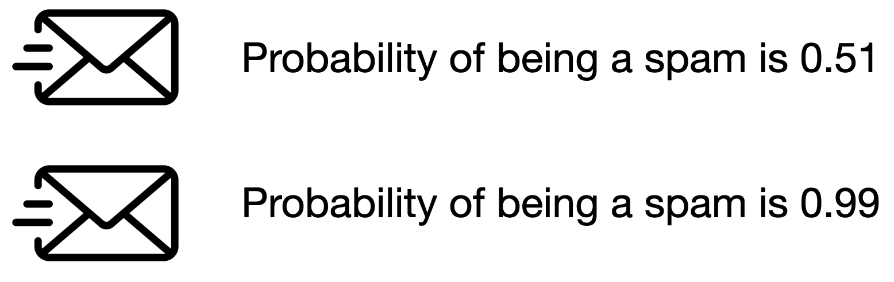
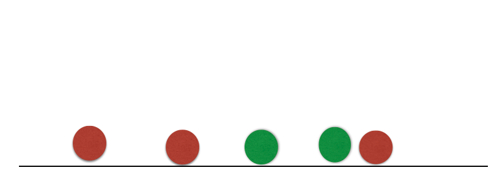
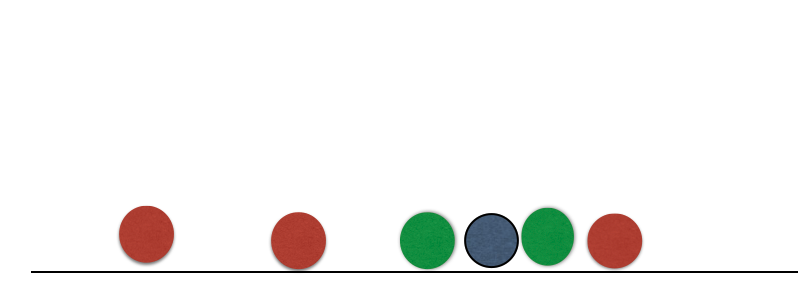
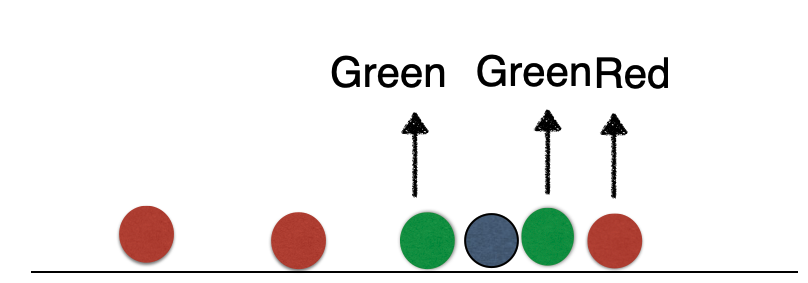
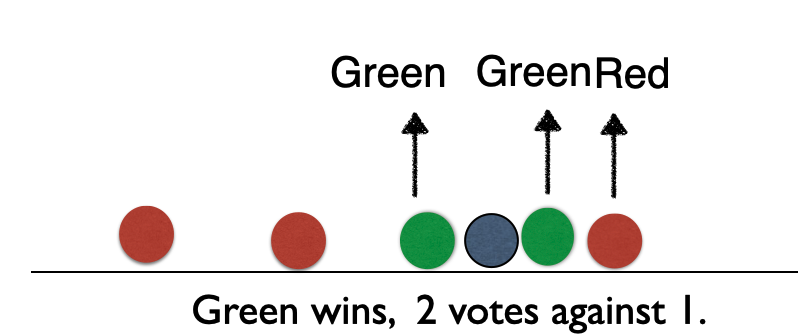
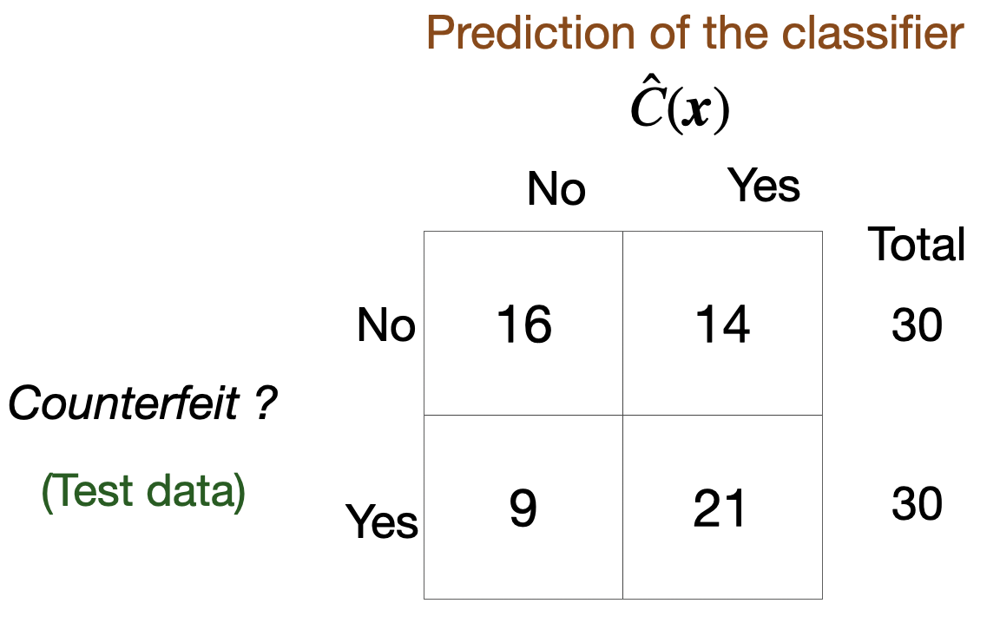
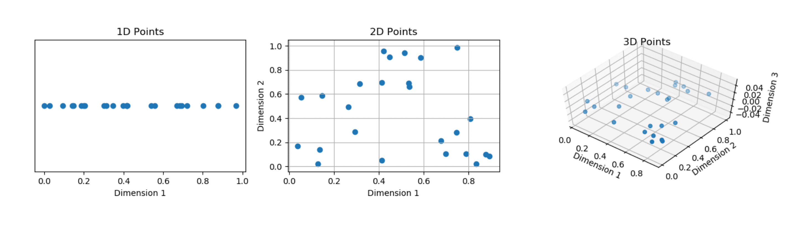

## Agenda

</br>

1.  Introduction
2.  *K*-Nearest Neighbours
3.  Confusion Matrix and Accuracy
4.  Finding the best value of *K*

## Load the libraries

</br>

Before we start, let's import the data science libraries into Python.

```{python}
#| echo: true
#| output: false

# Importing necessary libraries
import pandas as pd
import matplotlib.pyplot as plt
import seaborn as sns
from sklearn.model_selection import train_test_split, GridSearchCV
from sklearn.neighbors import KNeighborsClassifier
from sklearn.preprocessing import StandardScaler
from sklearn.metrics import confusion_matrix, ConfusionMatrixDisplay 
from sklearn.metrics import accuracy_score
```

Here, we use specific functions from the **pandas**, **matplotlib**, **seaborn** and **sklearn** libraries in Python.

## Main data science problems

</br>

[**Regression Problems**]{style="color:green;"}. The response is numerical. For example, a person's income, the value of a house, or a patient's blood pressure.

[**Classification Problems**]{style="color:blue;"}. The response is categorical and involves *K* different categories. For example, the brand of a product purchased (A, B, C) or whether a person defaults on a debt (yes or no).

The predictors ($\boldsymbol{X}$) can be *numerical* or *categorical*.

## Main data science problems

</br>

[**Regression Problems**. The response is numerical. For example, a person's income, the value of a house, or a patient's blood pressure.]{style="color:gray;"}

[**Classification Problems**]{style="color:blue;"}. The response is categorical and involves *K* different categories. For example, the brand of a product purchased (A, B, C) or whether a person defaults on a debt (yes or no).

The predictors ($\boldsymbol{X}$) can be *numerical* or *categorical*.

## Terminology

</br></br>

Explanatory variables or predictors:

-   $X$ represents an explanatory variable or predictor.
-   $\boldsymbol{X} = (X_1, X_2, \ldots, X_p)$ represents a collection of $p$ predictors.

## 

</br>

[Response]{style="text-decoration: underline;"}:

::: incremental
-   $Y$ is a [**categorical variable**]{style="color:darkgreen;"} that takes [**2 categories**]{style="color:darkgreen;"} or [**classes**]{style="color:darkgreen;"}.

-   For example, $Y$ can take [0]{style="color:darkgreen;"} or [1]{style="color:darkgreen;"}, [A]{style="color:darkgreen;"} or [B]{style="color:darkgreen;"}, [no]{style="color:darkgreen;"} or [yes]{style="color:darkgreen;"}, [spam]{style="color:darkgreen;"} or [no spam]{style="color:darkgreen;"}.

-   When classes are strings, they are usually encoded as 0 and 1.

    -   The **target class** is the one for which $Y = 1$.
    -   The **reference class** is the one for which $Y = 0$.
:::

## Classification algorithms

</br>

Classification algorithms use predictor values [to predict the class]{style="color:blue;"} of the response (target or reference).

</br>

That is, for an unseen record, they use predictor values to predict whether the record belongs to the target class or not.

</br>

Technically, [**they predict the probability**]{style="color:purple;"} that the record belongs to the target class.

## 

</br></br>

[**Goal**]{style="color:darkgreen;"}: Develop a function $C(\boldsymbol{X})$ for predicting $Y = \{0, 1\}$ from $\boldsymbol{X}$.

</br>

. . .

To achieve this goal, most algorithms consider functions $C(\boldsymbol{X})$ that [**predict the probability**]{style="color:brown;"} that $Y$ takes the value of 1.

</br>

. . .

A probability for each class can be very useful for gauging the model’s confidence about the predicted classification.

## Example 1

Consider a spam filter where $Y$ is the email type.

-   The target class is spam. In this case, $Y=1$.
-   The reference class is not spam. In this case, $Y=0$.

. . .

{fig-align="center" width="556" height="178"}

. . .

Both emails would be classified as spam. However, we'd have greater confidence in our classification for the second email.

## 

</br>

Technically, $C(\boldsymbol{X})$ works with the *conditional probability*:

$$P(Y = 1 | X_1 = x_1, X_2 = x_2, \ldots, X_p = x_p) = P(Y = 1 | \boldsymbol{X} = \boldsymbol{x})$$

In words, this is the probability that $Y$ takes a value of 1 [**given that**]{style="color:brown;"} the predictors $\boldsymbol{X}$ have taken the values $\boldsymbol{x} = (x_1, x_2, \ldots, x_p)$.

</br>

. . .

The conditional probability that $Y$ takes the value of 0 is

$$P(Y = 0 | \boldsymbol{X} = \boldsymbol{x}) = 1 - P(Y = 1 | \boldsymbol{X} = \boldsymbol{x}).$$

## Bayes classifier

</br>

It turns out that, if we know the true structure of $P(Y = 1 | \boldsymbol{X} = \boldsymbol{x})$, we can build a good classification function called the [**Bayes classifier**]{style="color:darkblue;"}:

$$C(\boldsymbol{X}) =
    \begin{cases}
      1, & \text{if}\ P(Y = 1 | \boldsymbol{X} = \boldsymbol{x}) > 0.5 \\
      0, & \text{if}\ P(Y = 1 | \boldsymbol{X} = \boldsymbol{x}) \leq 0.5
    \end{cases}.$$

This function classifies to the most probable class using the conditional distribution $P(Y | \boldsymbol{X} = \boldsymbol{x})$.

## 

</br>

[HOWEVER, we don’t (and will never) know the true form of $P(Y = 1 | \boldsymbol{X} = \boldsymbol{x})$!]{style="color:red;"}

</br>

. . .

To overcome this issue, we several standard solutions:

::: incremental
-   [**Logistic Regression**]{style="color:brown;"}: Impose an structure on $P(Y = 1 | \boldsymbol{X} = \boldsymbol{x})$. Not covered here.
-   [***K*****-Nearest Neighbours**]{style="color:darkgreen;"}: Estimate $P(Y = 1 | \boldsymbol{X} = \boldsymbol{x})$ directly. What we will cover today.
-   [**Classification Trees**]{style="color:darkblue;"} and [**Ensemble methods**]{style="color:orange;"}: Estimate $P(Y = 1 | \boldsymbol{X} = \boldsymbol{x})$ directly. Later.
:::

## Two datasets

</br></br>

The application of data science algorithms needs two data sets:

::: incremental
-   [**Training data**]{style="color:blue;"} is data that we use to train or construct the estimated function $\hat{C}(\boldsymbol{X})$.

-   [**Test data**]{style="color:green;"} is data that we use to evaluate the classification performance of $\hat{C}(\boldsymbol{X})$ only.
:::

## 

::::: columns
::: {.column width="30%"}
{width="256"}
:::

::: {.column width="70%"}
</br>

A random sample of $n$ observations.

Use it to **construct** $\hat{C}(\boldsymbol{X})$.
:::
:::::

::::: columns
::: {.column width="30%"}
{width="262"}
:::

::: {.column width="70%"}
Another random sample of $n_t$ observations, which is independent of the training data.

Use it to **evaluate** $\hat{C}(\boldsymbol{X})$.
:::
:::::


## Example 1: Identifying Counterfeit Banknotes

</br>


## Dataset

The data is located in the file "banknotes.xlsx".

```{python}
#| echo: true
#| output: true

bank_data = pd.read_excel("banknotes.xlsx")
# Set response variable as categorical.
bank_data['Status'] = pd.Categorical(bank_data['Status'])
bank_data.head()
```

## Let's generate training and test data

We split the current dataset into a training and a *test* dataset using `train_test_split()` from **scikit-learn**.

</br>

The function has three main inputs:

-   A pandas dataframe with the predictor columns only.
-   A pandas dataframe with the response column only.
-   The parameter `test_size` which sets the portion of the dataset that will go to the test set.

## Create the predictor matrix

We use the function `.filter()` from pandas to select two predictors: Top and Bottom.

```{python}
#| echo: true
#| output: true

# Set full matrix of predictors.
X_full = bank_data.filter(['Top', 'Bottom'])
X_full.head(4)
```

## Create the response column

We use the function `.filter()` from **pandas** to extract the column `Status` from the data frame. We store the result in `Y_full`.

```{python}
#| echo: true
#| output: true

# Set full matrix of responses.
Y_full = bank_data.filter(['Status'])
Y_full.head(4)
```

## Set the target category

To set the target category in the response we use the `get_dummies()` function.

```{python}
#| echo: true
#| output: true

# Create dummy variables.
Y_dummies = pd.get_dummies(Y_full, dtype = 'int')

# Select target variable.
Y_target_full = Y_dummies['Status_counterfeit']

# Show target variable.
Y_target_full.head() 
```

## Let's partition the dataset

</br>

```{python}
#| echo: true
#| output: true

X_train, X_test, Y_train, Y_test = train_test_split(X_full, Y_target_full,
                                                      stratify = Y_target_full,
                                                      test_size = 0.3)
```

-   The function makes a clever partition of the data using the *empirical* distribution of the response.

-   The argument `stratify` allows us to split the data so that the distribution of the response under the training and test sets is similar.

-   Usually, the proportion of the dataset that goes to the test set is 20% or 30%.

## Training Data

</br>

```{python}
#| echo: true
#| output: true

training_dataset = pd.concat([X_train, Y_train], axis = 1)
training_dataset.head()
```

## "Test" Data

</br>

```{python}
#| echo: true
#| output: true

test_dataset = pd.concat([X_test, Y_test], axis = 1)
test_dataset.head()
```

# *K*-nearest neighbors

## *K*-nearest neighbors (KNN)

KNN a supervised learning algorithm that uses proximity to make classifications or predictions about the clustering of a single data point.

-   **Basic idea**: Predict a new observation using the *K* closest observations in the training dataset.

To predict the response for a new observation, KNN uses the *K* nearest neighbors (observations) in [***terms of the predictors!***]{style="color:brown;"}

The predicted response for the new observation is the most common response among the *K* nearest neighbors.

## The algorithm has 3 steps:

</br></br>

::: incremental
1.  Choose the number of nearest neighbors (*K*).

2.  For a new observation, find the *K* closest observations in the training data (ignoring the response).

3.  For the new observation, the algorithm predicts the value of the most common response among the *K* nearest observations.
:::

## Nearest neighbour

Suppose we have two groups: red and green group. The number line shows the value of a predictor for our training data.

{fig-align="center"}

[A new observation arrives, and we don't know which group it belongs to. If we had chosen $K=3$, then the three nearest neighbors would vote on which group the new observation belongs to.]{style="color:white;"}

## Nearest neighbour

Suppose we have two groups: red and green group. The number line shows the value of a predictor for our training data.

{fig-align="center"}

A new observation arrives, and we don't know which group it belongs to. [If we had chosen $K=3$, then the three nearest neighbors would vote on which group the new observation belongs to.]{style="color:white;"}

## Nearest neighbour

Suppose we have two groups: red and green group. The number line shows the value of a predictor for our training data.

{fig-align="center"}

A new observation arrives, and we don't know which group it belongs to. If we had chosen $K=3$, then the three nearest neighbors would vote on which group the new observation belongs to.

## Nearest neighbour

Suppose we have two groups: red and green group. The number line shows the value of a predictor for our training data.

{fig-align="center"}

A new observation arrives, and we don't know which group it belongs to. If we had chosen $K=3$, then the three nearest neighbors would vote on which group the new observation belongs to.

## Banknote data

::::: columns
::: {.column width="70%"}
```{python}
#| fig-align: center
#| echo: false
#| output: true

from matplotlib.patches import Circle

bank_data = pd.read_excel("banknotes.xlsx")
# Set response variable as categorical.
bank_data['Status'] = pd.Categorical(bank_data['Status'])
# Set plot style
sns.set(style="whitegrid")

# Create the scatter plot using seaborn for discrete color mapping
plt.figure(figsize=(6.3, 6.3))
sns.scatterplot(
    data=bank_data,
    x='Top',
    y='Bottom',
    hue='Status',
    palette={'genuine': 'blue', 'counterfeit': 'orange'},
    s=15,
    edgecolor=None,
    legend='full'
)

# Axis labels
plt.xlabel("Top")
plt.ylabel("Bottom")

# Clean layout
plt.tight_layout()
plt.show()
```
:::

::: {.column width="30%"}
:::
:::::

Using $K = 3$, that's 2 votes for "genuine" and 2 for "fake." So we classify it as "genius."

## Banknote data

::::: columns
::: {.column width="70%"}
```{python}
#| fig-align: center
#| echo: false
#| output: true

from matplotlib.patches import Circle

bank_data = pd.read_excel("banknotes.xlsx")
# Set response variable as categorical.
bank_data['Status'] = pd.Categorical(bank_data['Status'])
# Set plot style
sns.set(style="whitegrid")

# Create the scatter plot using seaborn for discrete color mapping
plt.figure(figsize=(6.3, 6.3))
sns.scatterplot(
    data=bank_data,
    x='Top',
    y='Bottom',
    hue='Status',
    palette={'genuine': 'blue', 'counterfeit': 'orange'},
    s=15,
    edgecolor=None,
    legend='full'
)

# Add star point at (10, 10)
plt.plot(10, 10, marker='*', markersize=15, color='red', label='Special Point')

# Axis labels
plt.xlabel("Top")
plt.ylabel("Bottom")

# Clean layout
plt.tight_layout()
plt.show()
```
:::

::: {.column width="30%"}
:::
:::::

Using $K = 3$, that's 2 votes for "genuine" and 2 for "fake." So we classify it as "genius."

## Banknote data

::::: columns
::: {.column width="70%"}
```{python}
#| fig-align: center
#| echo: false
#| output: true

from matplotlib.patches import Circle

bank_data = pd.read_excel("banknotes.xlsx")
# Set response variable as categorical.
bank_data['Status'] = pd.Categorical(bank_data['Status'])
# Set plot style
sns.set(style="whitegrid")

# Create the scatter plot using seaborn for discrete color mapping
plt.figure(figsize=(6.3, 6.3))
sns.scatterplot(
    data=bank_data,
    x='Top',
    y='Bottom',
    hue='Status',
    palette={'genuine': 'blue', 'counterfeit': 'orange'},
    s=15,
    edgecolor=None,
    legend='full'
)

# Add star point at (10, 10)
plt.plot(10, 10, marker='*', markersize=15, color='red', label='Special Point')

# Add circle around the point with diameter = 1 unit (radius = 0.5)
circle = Circle((10, 10), 0.5, edgecolor='black', facecolor='none', linewidth=2)
plt.gca().add_patch(circle)

# Axis labels
plt.xlabel("Top")
plt.ylabel("Bottom")

# Clean layout
plt.tight_layout()
plt.show()
```
:::

::: {.column width="30%"}
</br>

Using $K = 3$, that's 3 votes for "counterfeit" and 0 for "genuine." So we classify it as "counterfeit."
:::
:::::

## Banknote data

::::: columns
::: {.column width="70%"}
```{python}
#| fig-align: center
#| echo: false
#| output: true

from matplotlib.patches import Circle

bank_data = pd.read_excel("banknotes.xlsx")
# Set response variable as categorical.
bank_data['Status'] = pd.Categorical(bank_data['Status'])
# Set plot style
sns.set(style="whitegrid")

# Create the scatter plot using seaborn for discrete color mapping
plt.figure(figsize=(6.3, 6.3))
sns.scatterplot(
    data=bank_data,
    x='Top',
    y='Bottom',
    hue='Status',
    palette={'genuine': 'blue', 'counterfeit': 'orange'},
    s=15,
    edgecolor=None,
    legend='full'
)

# Add star point at (10, 10)
plt.plot(10, 10, marker='*', markersize=15, color='red', label='Special Point')

# Add circle around the point with diameter = 1 unit (radius = 0.5)
circle = Circle((10, 10), 0.5, edgecolor='black', facecolor='none', linewidth=2)
plt.gca().add_patch(circle)

# Axis labels
plt.xlabel("Top")
plt.ylabel("Bottom")

# Clean layout
plt.tight_layout()
plt.show()
```
:::

::: {.column width="30%"}
</br>

Using $K = 3$, that's 3 votes for "counterfeit" and 0 for "genuine." So we classify it as "counterfeit."

[Closeness is based on Euclidean distance.]{style="color:darkblue;"}
:::
:::::

## Implementation Details

**Ties**

-   If there are more than *K* nearest neighbors, include them all.

-   If there is a tie in the vote, set a rule to break the tie. For example, randomly select the class.

</br>

**Predictor standarization**

- KNN uses the Euclidean distance between observations [**Therefore, as a first step, we must transform the predictors so that they have the same units!**]{style="color:darkred;"}

## Standardization in Python

</br>

To standardize **numeric** predictors, we use the `StandardScaler()` function. We also apply the function to variables using the `fit_transform()` function.

</br>

```{python}
#| echo: true

scaler = StandardScaler()
Xs_train = scaler.fit_transform(X_train)
```

## KNN in Python

</br>

In Python, we can use the `KNeighborsClassifier()` and `.fit()` from **scikit-learn** to train a KNN.

In the `KNeighborsClassifier` function, we can define the number of nearest neighbors using the `n_neighbors` parameter.

```{python}
#| echo: true
#| output: false

# For example, let's use KNN with three neighbours
knn = KNeighborsClassifier(n_neighbors=3)

# Now, we train the algorithm.
knn.fit(Xs_train, Y_train)
```

## Making Classifications

Using our trained KNN, we classify observations in the test dataset using only the predictor values from this set. To do this, we must first standardize the predictors in the test dataset.

```{python}
#| echo: true

Xs_test = scaler.fit_transform(X_test)
```

</br>

The `.predict()` function generates actual classes to which each observation was assigned.

```{python}
#| echo: true

Y_pred_knn = knn.predict(Xs_test)
```

## Classifications

</br></br></br>

```{python}
#| echo: true

Y_pred_knn
```

**0** for the reference class and **1** for the target class.

## 

The `predict_proba()` function generates the probabilities used by the algorithm to assign the classes.

```{python}
#| echo: true
#| output: true

predicted_probability = knn.predict_proba(Xs_test)
predicted_probability
```

# Confusion Matrix and Accuracy

## Confusion matrix

-   Table to evaluate the performance of a classifier.

-   Compares actual values with the predicted values of a classifier.

-   Useful for binary and multiclass classification problems.

{fig-align="center"}

## In Python

</br>

We calculate the confusion matrix using the homonymous function **scikit-learn**.

```{python}
#| echo: true
#| output: true

# Compute confusion matrix.
cm = confusion_matrix(Y_test, Y_pred_knn)

# Show confusion matrix.
print(cm)
```

## 

</br>

We can display the confusion matrix using the `ConfusionMatrixDisplay()` function.

```{python}
#| echo: true
#| output: true
#| fig-align: center

ConfusionMatrixDisplay(cm).plot()
```

## Accuracy

A simple metric for summarizing the information in the confusion matrix is **accuracy**. It is the proportion of correct classifications for both classes, out of the total classifications performed.

In Python, we calculate accuracy using the **scikit-learn** `accuracy_score()` function.

```{python}
#| echo: true
#| output: true

accuracy = accuracy_score(Y_test, Y_pred_knn)
print( round(accuracy, 2) )
```

The higher the accuracy, the better the performance of the classifier.

# Finding the best value of *K*

## Finding the best value of *K*

We can determine the best value of *K* for the KNN algorithm using [$K$-fold cross-validation (CVV)]{style="color:orange;"}. To this end, we need to set up a grid search to try out different values of $K$ and measure its performance in terms of the $K$-fold CV estimate of accuracy.

We specify the grid search as follows:

```{python}
#| echo: true
#| output: false

# Set the parameter to be changed and the range of values.
param_grid = {'n_neighbors': range(1, 31)}

# Create a KNeighborsClassifier object
knn_KFoldCV = KNeighborsClassifier()

# Set the grid search using K-fold CVV.
grid_search = GridSearchCV(knn_KFoldCV, param_grid, cv = 5, 
                           scoring = 'accuracy')
```

##

</br>

Now, we actually run the grid search.

```{python}
#| echo: true
#| output: false

# Run the search.
grid_search.fit(Xs_train, Y_train)
```

</br>

We see the K-fold CV estimates of accuracy for each value of *K*:

```{python}
#| echo: true
#| output: true

k_values = list(param_grid['n_neighbors'])
validation_accuracies = grid_search.cv_results_['mean_test_score']
validation_accuracies
```

## Visualize

We can then visualize the accuracy for different values of $K$ using the following graph and code.

```{python}
#| echo: true
#| output: true
#| fig-align: center
#| code-fold: true

# 2. Create the plot
plt.figure(figsize=(6.3, 4.3))
plt.plot(k_values, validation_accuracies, marker="o", linestyle="-", color='b')
plt.xlabel("Number of Neighbors (k)")
plt.ylabel("Validation Accuracy")
plt.title("Choosing the Best k for KNN")
plt.grid(True, linestyle='--', alpha=0.6)
plt.show()
```

## Best value of *K*

</br></br></br>

We can easily determine the best value of *K* using the function `.best_params_['n_neighbors']`.

```{python}
#| echo: true
#| output: true
#| 
# Find the best value of K
best_k = grid_search.best_params_['n_neighbors']
best_k
```

## Train the final KNN

</br>

Finally, we select the best number of nearest neighbors contained in the `best_k` object.

```{python}
#| echo: true
#| output: false

KNN_final = KNeighborsClassifier(n_neighbors = best_k)
KNN_final.fit(Xs_train, Y_train)
```

</br>

The accuracy of the best KNN is

```{python}
#| echo: true
#| output: true

Y_pred_KNNfinal = KNN_final.predict(Xs_test)
test_accuracy = accuracy_score(Y_test, Y_pred_KNNfinal)
print(test_accuracy)
```

## Discussion

</br>

KNN is intuitive and simple and can produce decent predictions. However, KNN has some disadvantages:

-   When the training dataset is very large, KNN is computationally expensive. This is because, to predict an observation, we need to calculate the distance between that observation and all the others in the dataset. ("*Lazy learner*").

-   In this case, a decision tree is more advantageous because it is easy to build, store, and make predictions with.

## 

::: {style="font-size: 90%;"}
-   The predictive performance of KNN deteriorates as the number of predictors increases.

-   This is because the expected distance to the nearest neighbor increases dramatically with the number of predictors, unless the size of the dataset increases exponentially with this number.

-   This is known as the ***curse of dimensionality***.
:::

{fig-align="center"}

::: {style="font-size: 50%;"}
<https://aiaspirant.com/curse-of-dimensionality/>
:::

# [Return to main page](https://alanrvazquez.github.io/TEC-5148/)
