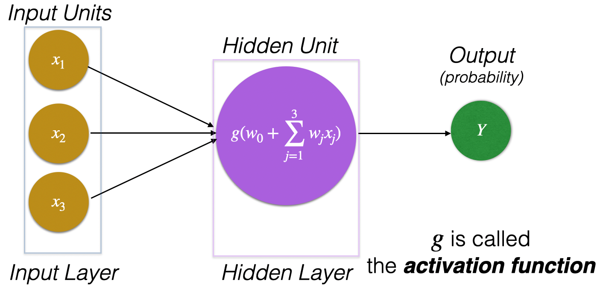
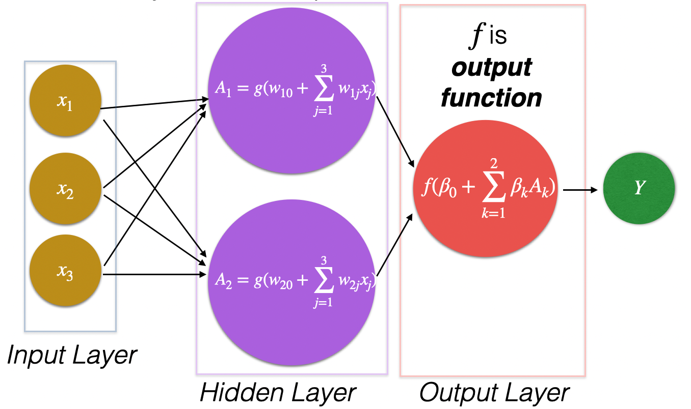
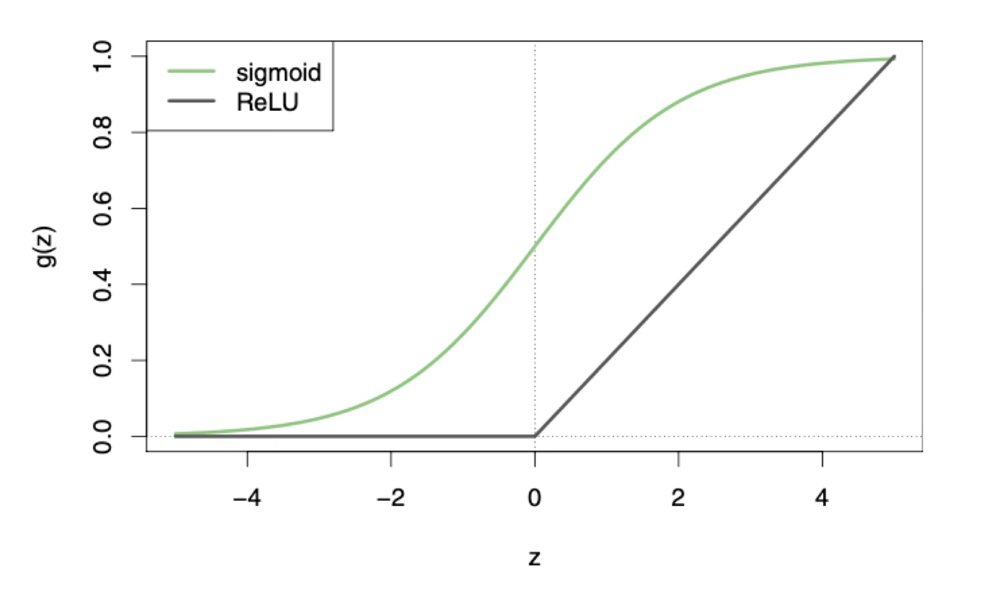
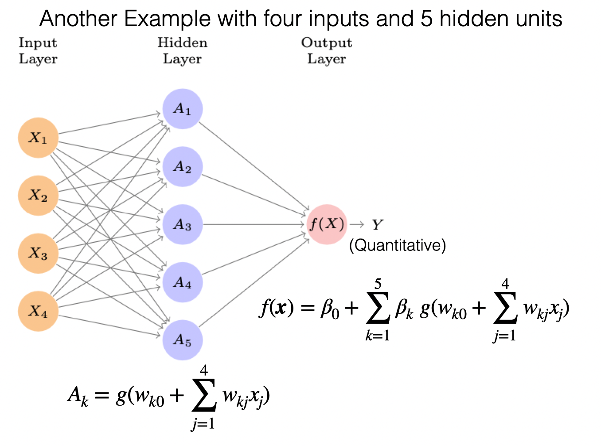
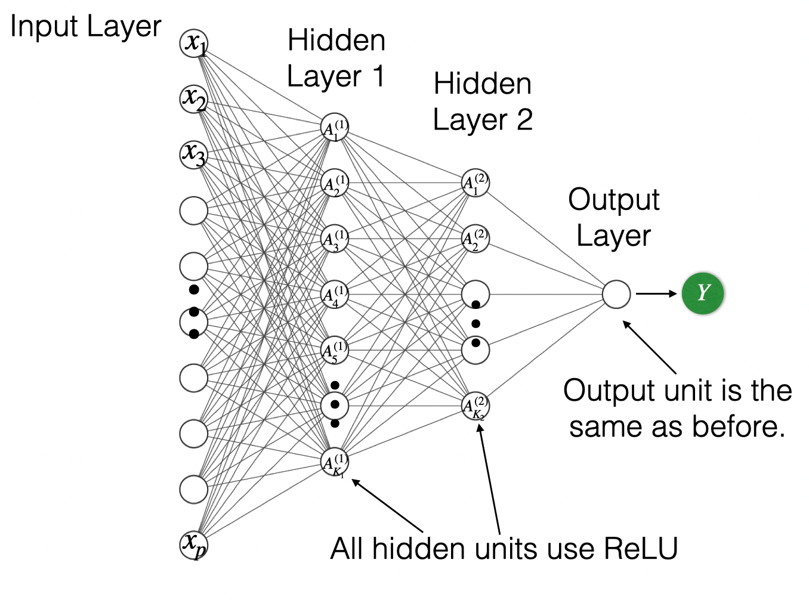
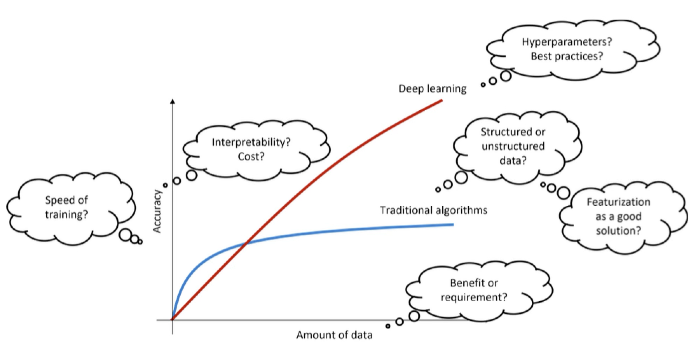
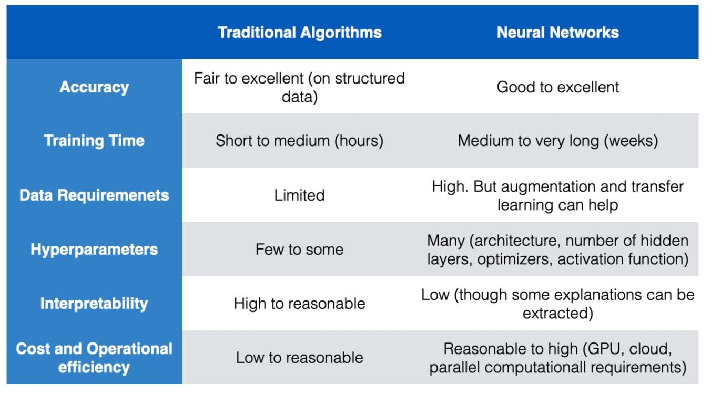

## Agenda

</br></br>

1.  Basics and Terminology

2.  Application

3.  When to use a Neural Network

# Basics and Terminology

## [Historical Background]{style="color:gold;"}

::: {style="font-size: 90%;"}
-   The idea of having “an electronic brain” dates back to the 1940s.

-   Neural networks rose to fame in the late 1980s, but they did not take off due to the lack of computing power and the discovery of mathematically tractable machine algorithms such as *Support Vector Machines*.

-   In the 2010s, NN resurged thanks to the computational speed ups given by newly developed GPUs. They also changed their names to **deep learning**.

-   Many innovations follow such as massively parallel computing with GPUs, modern architechtures such as CNNs and RNNS, modern optimization algorithms to train NN, and so on.
:::

## Nowadays...

</br></br>

NN have become prominent in many scientific fields.

Their most succesful applications include image classification, video classification, etc. Some of them are fun:

-   <https://quickdraw.withgoogle.com/>

-   <https://tenso.rs/demos/rock-paper-scissors/>

## Neural Network (NN)

Essentially, a neural network is a [**nonlinear function**]{style="color:#D03D56;"} $f(\boldsymbol{X})$ to predict the response $Y$ using a vector of p inputs, $\boldsymbol{X} = (X_1, X_2, ..., X_p)$.

> The function $f(\boldsymbol{X})$ can be represented as a “network” with several interconnected nodes.

The nodes and network structure might make us think of how the neurons in the brain are connected and communicate to each other. However, this is not true since we still do not know how the brain actually works!

## Terminology

</br></br>

- The structure of the NN is called its **architecture**, which depicts all the components and steps taken to reach the prediction.

- The nodes in the network are called **units**.

- The units are divided into groups called **layers**.

## Perceptron

The simplest type of neural network is the perceptron.

{fig-align="center"}

## Activation Function

> An *activation function* turns several input values into a single number.

NN were originally developed for classification tasks.

Therefore, they use the [Logistic]{style="color:#155084;"} or [Sigmoid]{style="color:#155084;"} function:

$$g(z) = \frac{1}{1 + e^{-z}}.$$

The function’s output is between 0 and 1, which can be interpreted as the probability for the target class.

## Single Layer NN...

has two layers and multiple hidden units.

{fig-align="center"}

## 

</br></br>

Modern NNs use the [Rectified Linear Unit (ReLU)]{style="color:#A9A9A9;"} as an activation function:

$$g(z) = \begin{cases} 0 \text{  if } z < 0 \\
z \text{  if } z \geq 0 \end{cases}$$

- The function’s output is between 0 and $\infty$.

- The ReLU function allows for a more computationally efficient training of a NN than the sigmoid function.

## 

{fig-align="center"}

## Output Function

</br></br>

The output function takes the values of the hidden units as inputs to output the final prediction of the response

</br>

The function $f$ depends on the type of problem:

-   [Regression]{style="color:darkblue;"}: $f(\beta_{0} + \sum_{k=1}^{2} \beta_{k} A_k) = \beta_{0} + \sum_{k=1}^{2} \beta_{k} A_k$

-   [Classification]{style="color:#darkgreen;"}: $f(\beta_{0} + \sum_{k=1}^{2} \beta_{k} A_k) = \frac{1}{1 + e^{-(\beta_{0} + \sum_{k=1}^{2} \beta_{k} A_k)}}$.

##

{fig-align="center"}

## Discussion

</br></br>

- The user must specify the network architecture: the number of hidden units ($K$) to use.

- The more hidden units, the longer the training time and the more complex the the NN.

- In theory, a NN with one layer and many units will work for any prediction or classification problem. In other words, a NN is a [***universal approximator***]{style="color:purple;"}.

## Multilayer Neural Networks

</br>

Multilayer NN have multiple hidden layers.

</br>

All neurons in one layer are fully connected to those in the next layer. This is referred to as a fully *connected* multilayer NN.

</br>

Three layers is typical, but more are possible too (a *deeper* multilayer NN).

##

{fig-align="center"}

## Some Comments

</br></br>

::: incremental
-   Multilayer NN are cheaper to train compared to a single layer NN with many hidden units.

-   This is because their training leverages modern in GPUs and parallel computing.

-   Ideally, the multilayer NN is not too wide and should not be too deep.
:::


# Application

## A new library: tensorflow

::::: columns
::: {.column width="30%"}
{fig-align="left"}
:::

::: {.column width="70%"}
-   **TensorFlow** is an open-source Python library for building and training machine learning models, especially neural networks.
-   It provides high-level APIs such as **Keras** for fast and intuitive model development.
-   It supports efficient computation on CPUs, GPUs, and TPUs for large-scale learning tasks.
-   <https://www.tensorflow.org/>
:::
:::::

```{python}
#| echo: true
#| output: false


```

## The libraries

</br></br>

Let's import **tensorflow** and our standard Python libraries.

```{python}
#| echo: true
#| output: false

import numpy as np
import matplotlib.pyplot as plt
import seaborn as sns
from sklearn.metrics import confusion_matrix, ConfusionMatrixDisplay
import tensorflow as tf
from tensorflow.keras.models import Sequential
from tensorflow.keras.layers import Dense
```

Here, we use specific functions from the **pandas**, **matplotlib**, **seaborn** and **sklearn** libraries in Python.

## Classifying Hand-Written Digits

</br>

The MNIST dataset is one of the most widely used datasets for illustrating the performance of neural networks.

- Contains 70,000 grayscale images of handwritten digits (0–9)
- Each image has a size of 28 × 28 pixels
- Pixel values range from 0 (black) to 255 (white)
- The response variable is the digit label (0–9)

**Goal**: Predict the correct digit based on the pixel values of the image.

## The MNIST dataset

It is a datasets in **tensorflow**. It even has its partition into training and test dataset, and into a predictor matrix and a response vector.

```{python}
#| echo: true

(x_train, y_train), (x_test, y_test) = tf.keras.datasets.mnist.load_data()
```

Let's inspect the shapes of the datasets.

```{python}
#| echo: true

print(f"Shape of x_train: {x_train.shape}")
print(f"Shape of y_train: {y_train.shape}")
print(f"Shape of x_test: {x_test.shape}")
print(f"Shape of y_test: {y_test.shape}")
```


## Example images


```{python}
#| echo: true
#| code-fold: true
#| output: true
#| fig-align: center

plt.figure(figsize=(10, 4))
for i in range(10):
    ax = plt.subplot(2, 5, i + 1)  # 2 rows, 5 columns    
    sns.heatmap(
        x_train[i],
        cmap='gray',
        cbar=False,
        xticklabels=False,
        yticklabels=False,
        ax=ax
    )    
    ax.set_title(f"Label: {y_train[i]}")
    ax.axis('off')
plt.suptitle('First 10 MNIST Training Images', fontsize=16)
plt.tight_layout(rect=[0, 0.03, 1, 0.95])
plt.show()
```


## Data Pre-processing

</br>

Neural networks work with inputs (or predictors) that take values between 0 and 1. For the images in the MNIST dataset, we can normalize the pixels of an image by dividing them by the largest pixel (255). 

</br>

In Python, it will be something like this:

```{python}
#| echo: true

x_train_normalized = x_train.astype('float32') / 255.0
x_test_normalized = x_test.astype('float32') / 255.0
```


## Flattening: Turn a matrix into a vector

</br>

The input images of the MNIST dataset are matrices. However, the neural networks take vectors as input, which is why we need to *flatten* each matrix of pixels into a single vector. 

</br>

We achieve this using the code below. Note that we apply it to the predictors from both the training and test dataset. 

```{python}
#| echo: true

image_size = x_train.shape[1] * x_train.shape[2] # 28 * 28 = 784
x_train_flattened = x_train_normalized.reshape(-1, image_size)
x_test_flattened = x_test_normalized.reshape(-1, image_size)
```

## 

</br></br>

Let's see the new dimensions of the input.

```{python}
#| echo: true

print(f"Shape of x_train_flattened after flattening: {x_train_flattened.shape}")
print(f"Shape of x_test_flattened after flattening: {x_test_flattened.shape}")
```

</br>

Since the images are $28 \times 28$, the predictor input is a $1 \times 784$ vector for each image.

## Pre-processing the response

We must also turn the response into a categorical response with its corresponding dummy variable encoding. First, we specify that there are 10 categories.

```{python}
#| echo: true

num_classes = 10
```

Next, we turn the responses into dummy variables in the training and test datasets.

```{python}
#| echo: true

y_train_one_hot = tf.keras.utils.to_categorical(y_train, num_classes)
y_test_one_hot = tf.keras.utils.to_categorical(y_test, num_classes)

print(f"Shape of y_train_one_hot after one-hot encoding: {y_train_one_hot.shape}")
print(f"Shape of y_test_one_hot after one-hot encoding: {y_test_one_hot.shape}")
```

## Setting the Structure of the Neural Network

The neural network we will build has the following structure:

1.  **Input Layer / First Hidden Layer**: A `Dense` layer with 256 units and a `ReLU` (Rectified Linear Unit) activation function. The `input_shape` is `(784,)`, corresponding to the flattened 28x28 MNIST images. ReLU is chosen as the activation function due to its computational efficiency and its ability to mitigate the vanishing gradient problem.

## 

</br></br>

2.  **Second Hidden Layer**: Another `Dense` layer with 128 units, also using `ReLU` activation. This layer further processes the features extracted by the previous layer.

3.  **Output Layer**: A `Dense` layer with 10 units, corresponding to the 10 possible digit classes (0-9) in the MNIST dataset. It uses a `Softmax` activation function, which outputs a probability distribution over the classes. The class with the highest probability is chosen as the model's prediction.


## In tensorflow

```{python}
#| echo: true

model = Sequential()
model.add(Dense(256, activation='relu', input_shape=(image_size,)))
model.add(Dense(128, activation='relu'))
model.add(Dense(num_classes, activation='softmax'))
model.compile(optimizer = 'adam', loss = 'categorical_crossentropy', 
              metrics = ['accuracy'])
model.summary()
```

## Number of epochs

To train a neural network, we must set the number of `epochs`, which are the number of times the trainiing algorithm passes through the entire dataset. 

The number of epochs can be seen as the iterations of the training algorithm. We expect that, the larger the number of epochs, the better the performance of the algorithm. However, larger numbers increases the computing time needed to train the network. 

Let's use 10 epochs as an example. 

```{python}
#| echo: true

epochs = 10
```

##  Batch size

</br>

Another important parameter is the `batch_size`. Essentially, this parameter controls the number of images that are processed during training. In other words, 64 samples are processed at a time in each iteration during training. 

</br>

It is recommended that this number is a power of two, such as 8, 16, 64, and 128. Here, we fix it to 64.

```{python}
#| echo: true

batch_size = 64
```

## Training

Now, we are ready to train the neural network.

```{python}
#| echo: true

history = model.fit(
    x_train_flattened, y_train_one_hot,
    epochs=epochs,
    batch_size=batch_size,
    validation_data=(x_test_flattened, y_test_one_hot)
)
```

## Evaluate Algorithm Performance

</br>

We evaluate the classification performance of the neural network using test data. To this end, we apply the neural network classifier using the function `.evaluate`. 

Remember, the input must be the flattened or vectorized images in `x_test_flattened` and the dummy coded responses in `y_test_one_hot`

```{python}
#| echo: true
#| output: false

test_loss, test_accuracy = model.evaluate(x_test_flattened, y_test_one_hot)

# Show the accuracy on the training dataset.
print(f"Test Accuracy: {test_accuracy:.4f}")
```

## Accuracy

</br></br></br>

In the multi-class problem, accuracy is still the proportion of correct decisions made.

```{python}
#| echo: true
#| output: true

print(f"Test Accuracy: {test_accuracy:.4f}")
```

## Individual Classifications

</br></br>

As with any classifier seen before, the neural network calculates the probability that an image belongs to each class (0-9). We can have a look at the proabilities using the function `.predict()`.

```{python}
#| echo: true
#| output: false

y_pred_probabilities = model.predict(x_test_flattened)
```

## 

</br></br></br>

Following the **Bayes classifier**, we classify each observation in the test dataset to the most probable class. This can be done using the command below, where `np.argmax()` is a function from **numpy** that takes the argument with the maximum value.

```{python}
#| echo: true

y_pred_labels = np.argmax(y_pred_probabilities, axis=1)
y_pred_labels
```

## Confusion Matrix 

```{python}
#| echo: true
#| code-fold: true
#| fig-align: center
#| output: true

y_true_labels = np.argmax(y_test_one_hot, axis=1)
cm = confusion_matrix(y_true_labels, y_pred_labels)
ConfusionMatrixDisplay(cm).plot()
```


# When to use a Neural Network

## General Remarks

</br></br>

-   The “deep” in deep learning is not a reference to any kind of deeper understanding achieved by the approach.

-   Instead, it stands for the idea of successive layers of representations.

-   Modern deep learning often involves tens or even hundres of sucessive layers.

## When should I use a NN?

{fig-align="center"}

## NN VS Other Algorithms

{fig-align="center"}


# [Return to main page](https://alanrvazquez.github.io/TEC-IN5148/)
